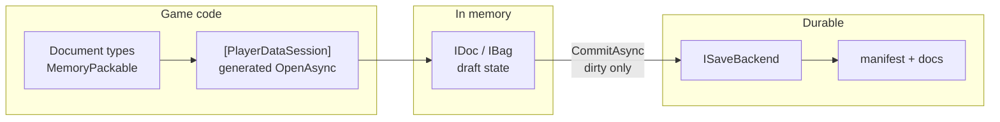
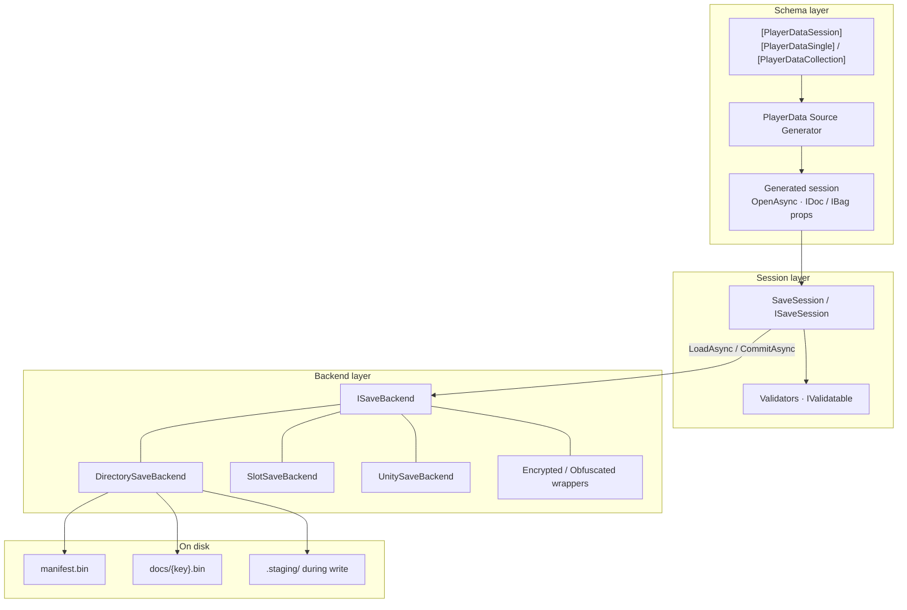

<a id="readme-top"></a>

<div align="center">

English | [日本語](./README_ja.md)

<h1>PlayerData</h1>

<p><em>Session-centric player save data for .NET and Unity — typed <code>IDoc</code> / <code>IBag</code> documents, <a href="https://github.com/Cysharp/MemoryPack">MemoryPack</a> persistence, and multi-document commit behind one clear save boundary.</em></p>

[](https://github.com/dreamingdog0529/PlayerData/actions/workflows/ci.yml)
[](https://github.com/dreamingdog0529/PlayerData/releases/latest)
[](LICENSE)
[](https://securityscorecards.dev/viewer/?uri=github.com/dreamingdog0529/PlayerData)

<p>
  <a href="docs/development.md"><strong>Explore the docs »</strong></a>
  <br /><br />
  <a href="https://github.com/dreamingdog0529/PlayerData/issues/new?template=bug_report.yml">Report Bug</a>
  ·
  <a href="https://github.com/dreamingdog0529/PlayerData/issues/new?template=feature_request.yml">Request Feature</a>
  ·
  <a href="https://github.com/dreamingdog0529/PlayerData/discussions">Discussions</a>
</p>

</div>

> [!WARNING]
> **Beta (0.x).** APIs, package surfaces, and generated code may change in **breaking** ways between minor/patch releases. Pin exact versions in production, and expect migration work until 1.0.

<details>
  <summary>Table of Contents</summary>
  <ol>
    <li><a href="#about">About The Project</a></li>
    <li><a href="#features">Features</a></li>
    <li>
      <a href="#getting-started">Getting Started</a>
      <ul>
        <li><a href="#prerequisites">Prerequisites</a></li>
        <li><a href="#installation">Installation</a></li>
      </ul>
    </li>
    <li>
      <a href="#usage">Usage</a>
      <ul>
        <li><a href="#quick-start">Quick start</a></li>
        <li><a href="#session-and-documents">Session and Documents</a></li>
        <li><a href="#commit-and-validation">Commit and Validation</a></li>
        <li><a href="#save-backends">Save Backends</a></li>
        <li><a href="#migrations">Migrations</a></li>
        <li><a href="#source-generator">Source Generator</a></li>
        <li><a href="#extension-packages">Extension Packages</a></li>
        <li><a href="#unity">Unity</a></li>
      </ul>
    </li>
    <li><a href="#architecture">Architecture</a></li>
    <li><a href="#development">Development</a></li>
    <li><a href="#roadmap">Roadmap</a></li>
    <li><a href="#contributing">Contributing</a></li>
    <li><a href="#project-docs">Project Docs</a></li>
    <li><a href="#license">License</a></li>
    <li><a href="#acknowledgments">Acknowledgments</a></li>
  </ol>
</details>

<a id="about"></a>

## About The Project

Session-centric player save data for .NET and Unity — typed `IDoc` / `IBag` documents, [MemoryPack](https://github.com/Cysharp/MemoryPack) persistence, and multi-document commit behind one clear save boundary.

PlayerData is for **player save data** (progress the player changes) that outgrows `PlayerPrefs` or a single JSON blob — not read-only master tables (see [MasterSheet](https://github.com/dreamingdog0529/MasterSheet) for those). Save systems have two conflicting needs: **frequent in-memory mutation** and **rare, consistent durable writes**. PlayerData splits that ownership deliberately:

* **Session is the boundary.** Documents compose into one `ISaveSession`; load and commit are session-wide, not per-field ad hoc files.
* **Attributes declare the surface.** `[PlayerDataSession]` + singles/collections are explicit — no reflection auto-discovery of "whatever was on disk."
* **The source generator owns the boilerplate.** `OpenAsync`, typed properties, and `ISaveSession` are generated so call sites stay thin and Unity-friendly (class-level attributes; no partial properties — Unity tops out at C# 12).
* **Memory is a draft; commit is the write.** Updaters may run under CAS; pure functions only. Validation is fail-fast **before** I/O so a bad commit leaves the previous save intact.
* **Backends are swappable.** `ISaveBackend` covers directory, slots, Unity paths, encryption wrappers — session code does not hard-code paths.
* **Adapters stay optional.** R3 / VitalRouter / MessagePipe are separate packages; VContainer integration ships inside PlayerData.Unity and auto-enables when VContainer is present. Core stays dependency-light.

In short: **types own shape; the session owns the boundary; the backend owns bytes on disk.**

```
Session (e.g. GameSave)
├── Profile    → IDoc<T>     single value
├── Settings   → IDoc<T>
└── Inventory  → IBag<K,T>   keyed collection
```

In-memory edits are a draft; `CommitAsync` validates, serializes **dirty documents only**, and writes through the backend. Commit is a no-op when not dirty.



### Built With

- [.NET Standard 2.1](https://learn.microsoft.com/dotnet/standard/net-standard)
- [MemoryPack](https://github.com/Cysharp/MemoryPack) — version-tolerant binary serialization
- [Roslyn](https://github.com/dotnet/roslyn) source generators
- [Unity](https://unity.com/) 6000.0+ (optional, via UPM)
- Optional adapters: [R3](https://github.com/Cysharp/R3), [VitalRouter](https://github.com/hadashiA/VitalRouter), [MessagePipe](https://github.com/Cysharp/MessagePipe)

<p align="right">(<a href="#readme-top">back to top</a>)</p>

<a id="features"></a>

## Features

- **One save boundary.** Compose documents into a single session; load and commit are session-wide and transactional.
- **Typed documents.** `IDoc<T>` single values and `IBag<TKey,T>` keyed collections with pure-function updates.
- **Generated boilerplate.** A Roslyn source generator emits `OpenAsync`, typed properties, and `ISaveSession` from class-level attributes.
- **Fail-fast validation.** Validators run before any I/O; a bad commit leaves the previous save intact.
- **Swappable backends.** Directory, slots, Unity paths, plus encryption / obfuscation / compression wrappers behind `ISaveBackend`.
- **Migrations.** Chained on load when the on-disk format version is older than the current one.
- **Unity integration.** `UnitySaveBackend`, `PlayerDataAutoSave`, an in-editor Data Viewer, Document Assets, and optional VContainer support.
- **Optional reactive adapters.** R3 observables, VitalRouter commands, and MessagePipe publishing as separate packages.

<p align="right">(<a href="#readme-top">back to top</a>)</p>

<a id="getting-started"></a>

## Getting Started

This library is distributed via NuGet, targeting .NET Standard 2.1. Unity is supported via UPM ([Unity](#unity)).

<a id="prerequisites"></a>

### Prerequisites

| Item | Requirement |
| --- | --- |
| Libraries | .NET Standard 2.1 |
| MemoryPack | 1.21.4+ |
| C# | `partial` classes |
| Unity (optional) | Unity 6+ UPM; install Core via [NuGetForUnity](https://github.com/GlitchEnzo/NuGetForUnity) **first** |

<a id="installation"></a>

### Installation

```bash
dotnet add package PlayerData.Core
# optional adapters
dotnet add package PlayerData.R3
dotnet add package PlayerData.VitalRouter
dotnet add package PlayerData.MessagePipe
```

<p align="right">(<a href="#readme-top">back to top</a>)</p>

<a id="usage"></a>

## Usage

<a id="quick-start"></a>

### Quick start

First, mark document types with MemoryPack:

```csharp
using MemoryPack;
using PlayerData;

[MemoryPackable(GenerateType.VersionTolerant)]
public partial record PlayerProfile(
    [property: MemoryPackOrder(0)] int Level,
    [property: MemoryPackOrder(1)] string Name)
{
    public static PlayerProfile NewGame() => new(1, "Hero");
}

[MemoryPackable(GenerateType.VersionTolerant)]
public partial record InventoryItem(
    [property: MemoryPackOrder(0), PlayerDataKey] string ItemId,
    [property: MemoryPackOrder(1)] int Count);
```

* Documents must be version-tolerant class types
* Collection entities need **exactly one** `[PlayerDataKey]`

Next, declare the session. Do not hand-write document properties; the source generator owns them.

```csharp
[PlayerDataSession]
[PlayerDataSingle(typeof(PlayerProfile), "Profile", Default = nameof(PlayerProfile.NewGame))]
[PlayerDataCollection(typeof(InventoryItem), "Inventory")]
public partial class GameSave { }
// → Profile: IDoc<PlayerProfile>, Inventory: IBag<string, InventoryItem>
```

Then open, mutate, and commit:

```csharp
await using var save = await GameSave.OpenAsync(new DirectorySaveBackend(path));

using (save.SuppressNotifications())
{
    save.Profile.Update(p => p with { Level = p.Level + 1 });
    save.Inventory.Upsert(new InventoryItem("potion", 1));
}

await save.CommitAsync();
```

| API | Behavior |
| --- | --- |
| `OpenAsync` | Construct + one `LoadAsync` |
| `Update` etc. | Memory only |
| `CommitAsync` | Validate → write; on failure disk unchanged, stays dirty |

<a id="session-and-documents"></a>

### Session and Documents

| Term | Meaning |
| --- | --- |
| Session | The open save as a whole (`ISaveSession` / generated `GameSave`) |
| Document | One unit inside the session (profile, inventory, …) |
| `IDoc<T>` | Single-value store: `Value` / `Update` / `Replace` |
| `IBag<TKey,T>` | Keyed collection: `Upsert` / `Update` / `Remove` … |
| dirty | User writes since last successful commit |
| Backend | `ISaveBackend` (directory, slots, Unity path, …) |

#### Session attributes

```csharp
[PlayerDataSession]
[PlayerDataSingle(typeof(PlayerProfile), "Profile", Default = nameof(PlayerProfile.NewGame))]
[PlayerDataSingle(typeof(Settings), "Settings")]
[PlayerDataCollection(typeof(InventoryItem), "Inventory", Key = "inv")]
public partial class GameSave { }
```

| Attribute | Role |
| --- | --- |
| `[PlayerDataSession]` | Session; optional `AutoCommitOnDispose` |
| `[PlayerDataSingle(typeof(T), name)]` | `IDoc<T>`; `Default` = static factory, else public parameterless ctor |
| `[PlayerDataCollection(typeof(T), name)]` | `IBag<TKey,T>`; key type from `[PlayerDataKey]` |
| `Key = "..."` | Override storage key (default = property name) |

Generator rules: valid identifiers; unique property names and storage keys; no clash with reserved members (`IsDirty`, `LoadAsync`, `OpenAsync`, …); class must be `partial` (**PD0008–PD0012**, **PD0006**).

#### `IDoc` / `IBag`

```csharp
// IDoc
var level = save.Profile.Value.Level;
save.Profile.Update(p => p with { Level = p.Level + 1 });
save.Profile.Replace(PlayerProfile.NewGame());

// IBag
save.Inventory.Upsert(new InventoryItem("potion", 3));
save.Inventory.Set("potion", new InventoryItem("potion", 5)); // key == keySelector(entity)
save.Inventory.Update("potion", i => i with { Count = i.Count + 1 });
save.Inventory.TryGet("potion", out var potion);
var snap = save.Inventory.Snapshot;
```

**Contracts**

* `Update` updaters must be **pure** (CAS may re-run them)
* `Set` enforces key == entity key
* Store `Changed` is **user writes only**; use session `Loaded` after load
* `IBag.Snapshot`: weakly consistent live view (not a frozen immutable snapshot)

State-threading overloads avoid capturing closures; existing `Func<T,T>` overloads remain:

```csharp
int delta = 3;
save.Profile.Update(delta, (d, p) => p with { Level = p.Level + d });
save.Inventory.GetOrAdd("potion", 1, (key, n) => new InventoryItem(key, n));
```

#### Manual session

```csharp
var session = new SaveSession(new DirectorySaveBackend(path));
var profile = session.AddDocument("Profile", PlayerProfile.NewGame);
var inventory = session.AddCollection<string, InventoryItem>("Inventory", i => i.ItemId);
await session.LoadAsync();
profile.Update(p => p with { Level = 2 });
await session.CommitAsync();
```

#### Suppress notifications

```csharp
using (save.SuppressNotifications())
{
    save.Profile.Update(p => p with { Level = 5 });
    save.Inventory.Upsert(new InventoryItem("key", 1));
} // coalesced flush of Changed / DirtyChanged on dispose
```

<a id="commit-and-validation"></a>

### Commit and Validation

Validation is fail-fast **before** I/O. On failure: disk untouched, session stays dirty.

```csharp
public sealed class GuardedData : IValidatable
{
    public int Value { get; init; }
    public void Validate()
    {
        if (Value < 0) throw new SaveValidationException("Value must be non-negative.");
    }
}

save.AddValidator(session => { /* throw to abort */ });
save.AddValidator(new MyValidator()); // ISaveValidator
```

Lifecycle members:

| Member | When |
| --- | --- |
| `LoadAsync` → `LoadResult` | `Found=false` keeps constructor defaults |
| `Loaded` | After load (including not found) |
| `CommitAsync` / `Committed` | Write only when dirty; after success |
| `DirtyChanged` | Dirty flag transitions |
| `IsLoaded` / `IsDirty` | State queries |

`AutoCommitOnDispose` commits on dispose when set; default `false`. Prefer explicit `CommitAsync` when write timing must be controlled.

```csharp
[PlayerDataSession(AutoCommitOnDispose = true)]
public partial class GameSave { }
```

<a id="save-backends"></a>

### Save Backends

| Implementation | Layout |
| --- | --- |
| `DirectorySaveBackend` | `{root}/manifest.bin`, `{root}/docs/{key}.bin` (via `.staging`) |
| `SlotSaveBackend` | `{root}/slot_{n}/…` |
| `UnitySaveBackend` | Under `Application.persistentDataPath` |
| `EncryptedSaveBackend` | Wraps another `ISaveBackend`; AES-256-CBC + HMAC-SHA256 |
| `ObfuscatedSaveBackend` | Wraps another `ISaveBackend`; fixed XOR, not a security feature |
| `CompressedSaveBackend` | Wraps another `ISaveBackend`; Deflate compression per document |
| Custom | `ISaveBackend` |

Save slots:

```csharp
await using var save = await GameSave.OpenAsync(new SlotSaveBackend(rootPath, slot: 0));
// Unity: UnitySaveBackend.Create(slot: 1)
```

A custom backend implements two methods:

```csharp
public interface ISaveBackend
{
    ValueTask<SaveBundle?> ReadAsync(CancellationToken cancellationToken = default); // null = none
    ValueTask WriteAsync(SaveBundle bundle, CancellationToken cancellationToken = default);
}
```

#### Encryption, Obfuscation & Compression

These wrap any `ISaveBackend` and transform each document's bytes on write/read; nothing about `SaveSession` / `IDoc` / `IBag` changes.

```csharp
// Real confidentiality + tamper detection (AES-256-CBC + HMAC-SHA256, Encrypt-then-MAC).
var backend = new EncryptedSaveBackend(new DirectorySaveBackend(path), key); // byte[] or passphrase
await using var save = await GameSave.OpenAsync(backend);
```

```csharp
// Deters casual tampering only — no key, no security claim.
var backend = new ObfuscatedSaveBackend(new DirectorySaveBackend(path));
```

```csharp
// Smaller on-disk documents (raw Deflate). Optional CompressionLevel; default is Fastest
// (fast writes, negligible size cost on real save data). Pass Optimal for the smallest payload.
var backend = new CompressedSaveBackend(new DirectorySaveBackend(path));
// var backend = new CompressedSaveBackend(inner, CompressionLevel.Optimal);
```

When combining compression with encryption, **compress first, then encrypt** so the compressor sees structured plaintext (ciphertext does not compress well):

```csharp
var backend = new EncryptedSaveBackend(
    new CompressedSaveBackend(new DirectorySaveBackend(path)),
    key);
```

| | `EncryptedSaveBackend` | `ObfuscatedSaveBackend` | `CompressedSaveBackend` |
| --- | --- | --- | --- |
| Key | `byte[]` or `string` passphrase, caller-supplied | None | None |
| Confidentiality | Yes (AES-256-CBC) | No — reversible without any secret | No |
| Tamper detection | Yes (`SaveTamperDetectedException` on mismatch) | No | No (corrupt payload → `InvalidDataException`) |
| Use when | Real protection against save editing or data extraction is required | You just don't want plain values visible in a hex/text editor | You want smaller save files |

Key/passphrase generation, storage, and rotation are the caller's responsibility; `PlayerData.Core` never persists or manages them. Only each document's byte value is transformed — document keys and `DirectorySaveBackend`'s `manifest.bin` / file names stay in plaintext (so a document's type name may still be inferable from its file name; `EncryptedSaveBackend` does bind the document key into its HMAC, so swapping ciphertext between documents is still detected). Unity + VContainer: pass `wrapBackend` to `RegisterPlayerDataSession` (see [VContainer](#vcontainer)).

<a id="migrations"></a>

### Migrations

Applied on load when on-disk version &lt; `SaveSession.CurrentFormatVersion`.

```csharp
public sealed class V1ToV2Migration : ISaveMigration
{
    public int FromVersion => 1;
    public int ToVersion => 2;
    public SaveBundle Migrate(SaveBundle bundle) => /* transform */ bundle;
}

await using var save = await GameSave.OpenAsync(backend, migrations: new[] { new V1ToV2Migration() });
```

Adding fields often works with MemoryPack alone. Unknown document keys on disk are ignored (forward-compatible).

<a id="source-generator"></a>

### Source Generator

The Roslyn source generator ships as an analyzer inside `PlayerData.Core`; consumers get it just by referencing the package. Diagnostics are **errors** (fail-closed) — no session members are emitted until fixed.

| ID | When | Fix |
| --- | --- | --- |
| **PD0001** | Missing version-tolerant MemoryPackable | `[MemoryPackable(GenerateType.VersionTolerant)]` on document types |
| **PD0002** | Not exactly one `[PlayerDataKey]` | One key property on collection entities |
| **PD0005** | Cannot resolve Default / parameterless ctor | `Default = nameof(...)` or public parameterless ctor |
| **PD0006** | Duplicate storage key | Unique `Key` / property names |
| **PD0008–PD0010** | Bad / duplicate / reserved property name | Rename; avoid `IsDirty`, `OpenAsync`, … |
| **PD0011** | Non-concrete or open type | Closed concrete document types |
| **PD0012** | Session not `partial` | `public partial class GameSave` |

`PD0003` / `PD0004` / `PD0007` are reserved / unused (class-level attributes only).

Runtime troubleshooting:

| Situation | Fix |
| --- | --- |
| Update but file unchanged | Call `CommitAsync` |
| UI stale after load | Use session `Loaded`, not store `Changed` |
| Commit throws | Validation failed; disk still previous save |
| Unity missing types | Install NuGet **Core before** UPM |
| Hand-wrote `IDoc` properties on session | Attributes only — let the generator emit members |
| Tamper / decrypt failure | Wrong key, or use `ObfuscatedSaveBackend` only when no security claim is needed |

<a id="extension-packages"></a>

### Extension Packages

| Package | Role |
| --- | --- |
| [PlayerData.Core](src/PlayerData.Core/) | **Required.** Runtime + source generator |
| [PlayerData.SourceGenerator](src/PlayerData.SourceGenerator/) | Dev; consumers get it via Core |
| [PlayerData.R3](src/PlayerData.R3/) | Observables |
| [PlayerData.VitalRouter](src/PlayerData.VitalRouter/) | VitalRouter commands |
| [PlayerData.MessagePipe](src/PlayerData.MessagePipe/) | MessagePipe publish |
| [PlayerData.Unity](src/PlayerData.Unity/Assets/PlayerData.Unity/) | `UnitySaveBackend` / `PlayerDataAutoSave` / optional VContainer (UPM) |

#### R3

```csharp
using PlayerData.R3;
save.Profile.AsObservable().Subscribe(/* default: replay current */);
save.Profile.AsObservable(replayCurrent: false);
save.Profile.AsChangeObservable();
save.Inventory.AsObservable();
```

#### VitalRouter / MessagePipe

```csharp
// VitalRouter: PlayerDataChangedCommand<T> (document types need not implement ICommand)
save.Profile.PublishChangesTo(publisher);

// MessagePipe: IPublisher<T> or IPublisher<DocChange<T>>
save.Profile.PublishChangesTo(publisher);
```

<a id="unity"></a>

### Unity

Minimum supported Unity version is 6000.0. Install `PlayerData.Core` (and MemoryPack) from NuGet via [NuGetForUnity](https://github.com/GlitchEnzo/NuGetForUnity) **first**, then add the UPM package by git URL:

```
https://github.com/dreamingdog0529/PlayerData.git?path=src/PlayerData.Unity/Assets/PlayerData.Unity
```

NuGet restores Roslyn source generators (`PlayerData.SourceGenerator`, `MemoryPack.Generator`) under `Assets/Packages/**/analyzers/**`. Unity may log *Unable to resolve reference 'Microsoft.CodeAnalysis'* for those DLLs — they are analyzers, not runtime plugins. After the UPM package is imported, PlayerData disables **Validate References** on them automatically; you can also uncheck it in the Plugin Inspector.

```csharp
var backend = UnitySaveBackend.Create();
var slot1   = UnitySaveBackend.Create(slot: 1);

await using var save = await GameSave.OpenAsync(backend);

var auto = gameObject.AddComponent<PlayerDataAutoSave>();
auto.IntervalSeconds = 30f;
auto.CommitOnPause = auto.CommitOnQuit = true;
auto.Bind(save); // dirty only; concurrent commits gated
```

#### Save Data Viewer (Editor)

`Window > PlayerData > Data Viewer` opens a two-pane window styled after the Project view: a save tree on the left, an editor for the selected document on the right. No play mode is required for on-disk saves.

The toolbar holds everything else:

- **Location dropdown** — the default entry, **This game's save folder** (`Application.persistentDataPath`, where Unity games store their save data), normally needs no change. Pick **Choose folder...** to point the viewer elsewhere; the choice is remembered per project, and the tooltip always shows the full path.
- **Refresh** — rescans the root. Scanning also runs when the window opens and when the root changes.
- **Save type** — short name of your `[PlayerDataSession]` class. Save binaries carry no type metadata, so the viewer resolves document types from this schema.
- **Search** — filters documents by display name (case-insensitive); parents of a match stay visible.

The tree groups everything found under the root:

- **Saved files** — every save below the root (up to 3 levels deep, including `slot_N` folders), shown as paths relative to the root (`(root)` for the root itself). Each save expands into its documents (property name + plain status: Editable / View only / Can't read).
- **Playing now** — appears only during play mode, listing registered live sessions and their documents.

Click a document and the right pane shows its name, status, and location, a **Fields** ⇔ **JSON** toggle, and **Apply** / **Revert**. Both views share one working copy: switching keeps unapplied edits, and switching from JSON to Fields with invalid JSON stays on JSON with the error shown. The toggle choice is remembered. Selecting another document discards unapplied edits.

**Live sessions** are opt-in — register your session and it appears under **Playing now** during play mode:

```csharp
await using var save = await GameSave.OpenAsync(backend);

// Safe without #if UNITY_EDITOR: in player builds Register stores nothing and
// returns a shared no-op token, so game code pays zero overhead.
IDisposable viewerToken = LiveSessionRegistry.Register("Main Save", save);

// On teardown, alongside closing the session:
viewerToken.Dispose();
```

Live documents are edited in the same pane; **Apply** goes through the session APIs (`IDoc<T>.Replace`, `IBag<TKey,T>.Set/Upsert/Remove`), so the running game sees ordinary `Changed` events (`DataChangeCause.UserWrite`). Stopping play mode removes the **Playing now** group.

Collection documents (`IBag`) are edited Inspector-style in the **Fields** view: one sub-form per entry, an **Add entry** button at the bottom, and a **Remove** button on each entry. An entry's key *is* the entity's `[PlayerDataKey]` member value, so editing that field renames the entry (duplicate keys are flagged in red and block Apply). You can still edit the whole object directly in the **JSON** view.

| Member type | Fields editor |
| --- | --- |
| `bool` | Toggle |
| `string` | Text field |
| Numeric (`int`, `float`, `decimal`, …) | Validated text — invalid input turns red and blocks Apply |
| Enum | Dropdown |
| Anything else (nested objects, lists, `DateTime`, nullable, …) | Read-only preview; edit via the JSON view |

Safety rules:

- A disk document is editable only when its `bytes → JSON → bytes` round-trip reproduces the payload exactly; otherwise it is **View only**.
- Encrypted / obfuscated saves cannot be decoded and show as **Can't read**. Unknown keys are preserved on write-back.
- Saves whose `FormatVersion` differs from the current one are **View only (old format)** — open the game once so migrations can run.
- Read-only documents show the reason on the status label and keep **Apply** disabled. Live documents that cannot round-trip through JSON are view-only as well.
- **Applied edits take effect immediately and cannot be undone**.

The on-disk binary format is unchanged: no type metadata is embedded in `manifest.bin` / `docs/*.bin`. The viewer resolves types from the selected save type.

#### Editor Document Assets (fixtures)

For sample / QA fixtures in the Project window (not runtime player saves), create **Assets > Create > PlayerData > Document Asset**.

1. Pick the **Save type** (`[PlayerDataSession]` class) and **Document** (storage key).
2. Edit with **Fields** (single documents) or **JSON** (lists / nested values).
3. **Apply to Asset** stores the payload as JSON on the ScriptableObject.
4. Optionally **Export to Save Folder** merges the document into a `DirectorySaveBackend` layout (`manifest.bin` + `docs/*.bin`), preserving any other documents already in that folder.

These assets live in the **Editor** assembly — game runtime code does not load them, and Core binaries stay type-free. They are for authoring fixtures in the Inspector the way you would pick a model or AudioClip, without embedding schema metadata into save files.

#### VContainer

Optional [VContainer](https://github.com/hadashiA/VContainer) integration ships **inside** `PlayerData.Unity` (Cysharp-style `Runtime/External`). When `jp.hadashikick.vcontainer` is installed, the `PlayerData.Unity.VContainer` assembly is auto-enabled via asmdef version defines — no separate PlayerData package is required. Without VContainer, the assembly is simply not compiled.

Add PlayerData.Unity (and VContainer itself) to `Packages/manifest.json`:

```json
"com.dreamingdog0529.playerdata": "https://github.com/dreamingdog0529/PlayerData.git?path=src/PlayerData.Unity/Assets/PlayerData.Unity",
"jp.hadashikick.vcontainer": "https://github.com/hadashiA/VContainer.git?path=VContainer/Assets/VContainer#1.19.0"
```

```csharp
using PlayerData.Unity;
using VContainer;

// In LifetimeScope.Configure:
// Registers ISaveBackend (UnitySaveBackend) + GameSave singleton, then LoadAsync on IAsyncStartable.
builder.RegisterPlayerDataSession<GameSave>(relativeFolder: "PlayerData", slot: 0);

// With EncryptedSaveBackend / ObfuscatedSaveBackend layered on top of UnitySaveBackend:
builder.RegisterPlayerDataSession<GameSave>(
    relativeFolder: "PlayerData",
    wrapBackend: b => new EncryptedSaveBackend(b, key));
```

<p align="right">(<a href="#readme-top">back to top</a>)</p>

<a id="architecture"></a>

## Architecture



| Layer | Player device |
| --- | --- |
| Core + generated session | **Yes** (runtime) |
| R3 / VitalRouter / MessagePipe | Optional adapters |
| Unity Runtime / VContainer | Hosting layer |
| SourceGenerator project | Dev only (analyzer via Core) |

**On disk (`DirectorySaveBackend`)**

```
{root}/manifest.bin
{root}/docs/{key}.bin
{root}/.staging/   # during write only
```

Stage → promote docs → replace manifest. Mid-write crash tends to leave the previous consistent save.

<p align="right">(<a href="#readme-top">back to top</a>)</p>

<a id="development"></a>

## Development

Repository layout:

```
src/       PlayerData.Core and adapter libraries; src/PlayerData.Unity is a Unity project
tests/     unit + source generator integration tests
sandbox/   BenchmarkDotNet project
```

Build and test:

```bash
dotnet build src/PlayerData.Core/PlayerData.Core.csproj   # packs Core into the local feed
dotnet build PlayerData.slnx
dotnet test PlayerData.slnx
```

Integration tests consume the packed Core nupkg from `../.local-feed` (see `nuget.config`), so build Core once before restoring the full solution. Or use the [Task](https://taskfile.dev/) wrappers:

```bash
task build
task test
task check   # spellcheck + commit-lint + dco-check + build + test
```

The Unity project (`src/PlayerData.Unity`) restores its precompiled DLLs via NuGetForUnity; the binaries under `Assets/Packages/` are not committed. Restore them once before opening the project:

```bash
dotnet build src/PlayerData.Core/PlayerData.Core.csproj   # pack Core into the local feed first
dotnet tool install --global NuGetForUnity.Cli
nugetforunity restore src/PlayerData.Unity
```

Unity EditMode tests run from the Test Runner window, or headless via `Unity.exe -batchmode -projectPath src/PlayerData.Unity -runTests -testPlatform EditMode -testResults <xml> -logFile <log>`.

Full development and build instructions: **[docs/development.md](docs/development.md)**
How to contribute: **[CONTRIBUTING.md](.github/CONTRIBUTING.md)**

<p align="right">(<a href="#readme-top">back to top</a>)</p>

<a id="roadmap"></a>

## Roadmap

See the [open issues](https://github.com/dreamingdog0529/PlayerData/issues) and
[ROADMAP.md](ROADMAP.md) for planned features and known issues.

<p align="right">(<a href="#readme-top">back to top</a>)</p>

<a id="contributing"></a>

## Contributing

Contributions are welcome. Please read **[CONTRIBUTING.md](.github/CONTRIBUTING.md)** for the
workflow (Conventional Commits, DCO sign-off, PR process) and our
[Code of Conduct](.github/CODE_OF_CONDUCT.md).

Thanks to everyone who has contributed to PlayerData. This list is updated automatically from git history.

<!-- readme: contributors -start -->
<table>
	<tbody>
		<tr>
            <td align="center">
                <a href="https://github.com/dreamingdog0529">
                    
                    <br />
                    <sub><b>dreamingdog0529</b></sub>
                </a>
            </td>
            <td align="center">
                <a href="https://github.com/claude">
                    
                    <br />
                    <sub><b>Claude</b></sub>
                </a>
            </td>
		</tr>
	<tbody>
</table>
<!-- readme: contributors -end -->

<p align="right">(<a href="#readme-top">back to top</a>)</p>

<a id="project-docs"></a>

## Project Docs

| Document | Purpose |
|----------|---------|
| [CONTRIBUTING.md](.github/CONTRIBUTING.md) | Develop, test, PRs, DCO, CI/CD, releases |
| [SUPPORT.md](.github/SUPPORT.md) | How to get help |
| [ROADMAP.md](ROADMAP.md) | Direction and how to propose work |
| [CODE_OF_CONDUCT.md](.github/CODE_OF_CONDUCT.md) | Community standards |
| [SECURITY.md](.github/SECURITY.md) | Private vulnerability reporting |
| [CODEOWNERS](CODEOWNERS) | Default code review owners |
| [CHANGELOG.md](CHANGELOG.md) | Release history |
| [LICENSE](LICENSE) | MIT license text |

<p align="right">(<a href="#readme-top">back to top</a>)</p>

<a id="license"></a>

## License

Distributed under the MIT License. See [LICENSE](LICENSE) for more information.

MIT © 2026 dreamingdog0529

<p align="right">(<a href="#readme-top">back to top</a>)</p>

<a id="acknowledgments"></a>

## Acknowledgments

- [MemoryPack](https://github.com/Cysharp/MemoryPack) — version-tolerant binary serialization
- [NuGetForUnity](https://github.com/GlitchEnzo/NuGetForUnity) — NuGet packages in Unity

<p align="right">(<a href="#readme-top">back to top</a>)</p>
