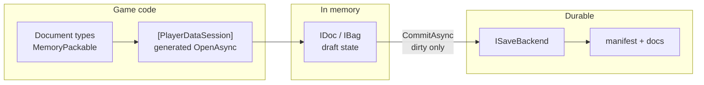
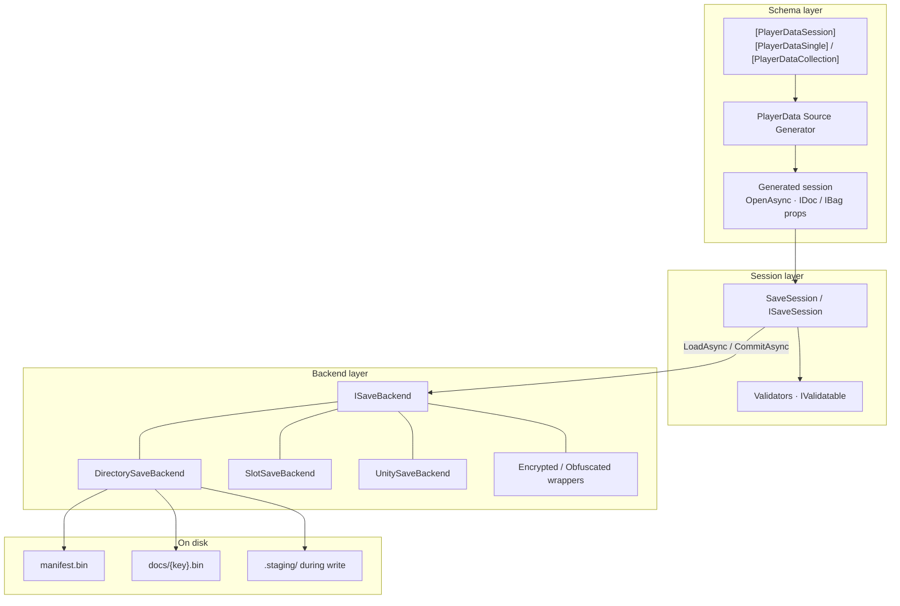

# PlayerData

[English](README.md) | [日本語](README_ja.md)

> Session-centric player save data — typed `IDoc` / `IBag`, MemoryPack persistence, multi-document commit.

[](LICENSE)
[](#packages)
[](https://semver.org/#spec-item-4)

> [!WARNING]
> **Beta (0.x).** APIs, package surfaces, and generated code may change in **breaking** ways between minor/patch releases. Pin exact versions in production, and expect migration work until 1.0.

## Table of Contents

<details>
<summary>Details</summary>

- [Overview](#overview)
  - [Where it fits](#where-it-fits)
  - [Why this design](#why-this-design)
  - [Terminology](#terminology)
  - [Features](#features)
  - [Packages](#packages)
- [Setup](#setup)
- [Quick Start](#quick-start)
- [Basic Usage](#basic-usage)
  - [Session attributes](#session-attributes)
  - [`IDoc` / `IBag`](#idoc--ibag)
  - [Manual session](#manual-session)
  - [Suppress notifications](#suppress-notifications)
  - [Commit validation](#commit-validation)
  - [Backends](#backends)
  - [Lifecycle](#lifecycle)
- [Advanced Usage](#advanced-usage)
  - [State-threading updates](#state-threading-updates)
  - [Save slots](#save-slots)
  - [Migrations](#migrations)
  - [Custom `ISaveBackend`](#custom-isavebackend)
  - [Encryption & Obfuscation](#encryption--obfuscation)
  - [SG diagnostics](#sg-diagnostics)
  - [AutoCommitOnDispose](#autocommitondispose)
- [Extension Packages](#extension-packages)
  - [R3](#r3)
  - [VitalRouter / MessagePipe](#vitalrouter--messagepipe)
  - [Unity](#unity)
  - [Unity + VContainer](#unity--vcontainer)
- [Architecture](#architecture)
- [Troubleshooting](#troubleshooting)
- [Documentation](#documentation)
- [Contributing](#contributing)
- [License](#license)
- [Author](#author)

</details>

## Overview

### Where it fits

For **player save data** (progress the player changes) that outgrows `PlayerPrefs` or a single JSON blob. Not read-only master tables — see [MasterSheet](https://github.com/dreamingdog0529/MasterSheet) for spreadsheet → MasterMemory masters.

Typical drift:

| Problem | Effect |
| --- | --- |
| Save logic scattered across systems | No single load/save boundary |
| Whole-file rewrite every change | Slow I/O, hard to reason about dirty state |
| Silent schema changes on disk | Corruption / lost fields without a migration story |

**PlayerData** gives you a **clear save boundary** — not a database or ORM:

- Compose multiple documents into **one session**
- Update in memory with CAS-style ops; `CommitAsync` writes **dirty documents only**
- Persist with [MemoryPack](https://github.com/Cysharp/MemoryPack) (version-tolerant)

```
Session (e.g. GameSave)
├── Profile    → IDoc<T>     single value
├── Settings   → IDoc<T>
└── Inventory  → IBag<K,T>  keyed collection
```

In-memory edits are a draft; `CommitAsync` is the durable write. Commit is a no-op when not dirty.

**For:** Unity / .NET teams that want one place for load/save.  
**Not for:** server-as-only-source-of-truth designs (fine as a local cache).

### Why this design

Save systems have two conflicting needs: **frequent in-memory mutation** and **rare, consistent durable writes**.

So PlayerData splits ownership deliberately:

1. **Session is the boundary.** Documents compose into one `ISaveSession`. Load and commit are session-wide, not per-field ad hoc files.
2. **Attributes declare the surface.** `[PlayerDataSession]` + singles/collections are explicit — no reflection auto-discovery of “whatever was on disk.”
3. **SG owns the boilerplate.** `OpenAsync`, typed properties, and `ISaveSession` are generated so call sites stay thin and Unity-friendly (class-level attributes; no partial properties — Unity tops out at C# 12).
4. **Memory is a draft; commit is the write.** Updaters may run under CAS; pure functions only. Validation is fail-fast **before** I/O so a bad commit leaves the previous save intact.
5. **Backends are swappable.** `ISaveBackend` covers directory, slots, Unity paths, encryption wrappers — session code does not hard-code paths.
6. **Adapters stay optional.** R3 / VitalRouter / MessagePipe / VContainer are separate packages; Core stays dependency-light.

In short: **types own shape; the session owns the boundary; the backend owns bytes on disk.**



### Terminology

| Term | Meaning |
| --- | --- |
| Session | The open save as a whole (`ISaveSession` / generated `GameSave`) |
| Document | One unit inside the session (profile, inventory, …) |
| `IDoc<T>` | Single-value store: `Value` / `Update` / `Replace` |
| `IBag<TKey,T>` | Keyed collection: `Upsert` / `Update` / `Remove` … |
| dirty | User writes since last successful commit |
| Backend | `ISaveBackend` (directory, slots, Unity path, …) |
| SG | Roslyn source generator (shipped as analyzer inside Core) |

### Features

1. Mark document types with MemoryPack  
2. Declare the session with `[PlayerDataSession]` + `[PlayerDataSingle]` / `[PlayerDataCollection]` (class-level attributes — no partial properties; Unity tops out at C# 12)  
3. SG emits `OpenAsync`, properties, and `ISaveSession`  
4. `CommitAsync`: validate → serialize dirty only → backend write  

```csharp
[PlayerDataSession]
[PlayerDataSingle(typeof(PlayerProfile), "Profile", Default = nameof(PlayerProfile.NewGame))]
[PlayerDataCollection(typeof(InventoryItem), "Inventory")]
public partial class GameSave { }

await using var save = await GameSave.OpenAsync(new DirectorySaveBackend(path));
save.Profile.Update(p => p with { Level = p.Level + 1 });
await save.CommitAsync();
```

| Area | Detail |
| --- | --- |
| Composition | Explicit attributes only |
| Updates | CAS may retry → pure updaters |
| Commit | Dirty-only, fail-fast validation |
| Notifications | `SuppressNotifications()` coalesces `Changed` / `DirtyChanged` |
| Durability | `DirectorySaveBackend`: staging + manifest promote |
| Slots / evolve | `SlotSaveBackend`, `ISaveMigration` |
| Adapters | R3 / VitalRouter / MessagePipe, Unity UPM + VContainer |
| Target | .NET Standard 2.1 |

### Packages

| Package | Role |
| --- | --- |
| [PlayerData.Core](PlayerData.Core/) | **Required.** Runtime + SG |
| [PlayerData.SourceGenerator](PlayerData.SourceGenerator/) | Dev; consumers get it via Core |
| [PlayerData.R3](PlayerData.R3/) | Observables |
| [PlayerData.VitalRouter](PlayerData.VitalRouter/) | VitalRouter commands |
| [PlayerData.MessagePipe](PlayerData.MessagePipe/) | MessagePipe publish |
| [PlayerData.Unity](PlayerData.Unity/) | `UnitySaveBackend` / `PlayerDataAutoSave` |
| [PlayerData.Unity.VContainer](PlayerData.Unity.VContainer/) | `RegisterPlayerDataSession` (optional) |

## Setup

| Item | Requirement |
| --- | --- |
| Libraries | .NET Standard 2.1 |
| MemoryPack | 1.21.4+ |
| C# | `partial` classes |
| Unity (optional) | Unity 6+ UPM; install Core via [NuGetForUnity](https://github.com/GlitchEnzo/NuGetForUnity) **first** |

```bash
dotnet add package PlayerData.Core
# optional
dotnet add package PlayerData.R3
dotnet add package PlayerData.VitalRouter
dotnet add package PlayerData.MessagePipe
```

```xml
<PackageReference Include="PlayerData.Core" Version="0.1.0" />
```

Unity: NuGet Core → then UPM ([Unity](#unity)).

## Quick Start

### 1. Document types

```csharp
using MemoryPack;
using PlayerData;

[MemoryPackable(GenerateType.VersionTolerant)]
public partial record PlayerProfile(
    [property: MemoryPackOrder(0)] int Level,
    [property: MemoryPackOrder(1)] string Name)
{
    public static PlayerProfile NewGame() => new(1, "Hero");
}

[MemoryPackable(GenerateType.VersionTolerant)]
public partial record InventoryItem(
    [property: MemoryPackOrder(0), PlayerDataKey] string ItemId,
    [property: MemoryPackOrder(1)] int Count);
```

- Documents must be version-tolerant class types  
- Collection entities need **exactly one** `[PlayerDataKey]`

### 2. Session declaration

Do not hand-write document properties; the SG owns them.

```csharp
[PlayerDataSession]
[PlayerDataSingle(typeof(PlayerProfile), "Profile", Default = nameof(PlayerProfile.NewGame))]
[PlayerDataCollection(typeof(InventoryItem), "Inventory")]
public partial class GameSave { }
// → Profile: IDoc<PlayerProfile>, Inventory: IBag<string, InventoryItem>
```

| Attribute | Role |
| --- | --- |
| `[PlayerDataSession]` | Session; optional `AutoCommitOnDispose` |
| `[PlayerDataSingle(typeof(T), name)]` | `IDoc<T>`; `Default` = static factory, else public parameterless ctor |
| `[PlayerDataCollection(typeof(T), name)]` | `IBag<TKey,T>`; key type from `[PlayerDataKey]` |
| `Key = "..."` | Override storage key (default = property name) |

### 3. Open, mutate, commit

```csharp
await using var save = await GameSave.OpenAsync(new DirectorySaveBackend(path));

using (save.SuppressNotifications())
{
    save.Profile.Update(p => p with { Level = p.Level + 1 });
    save.Inventory.Upsert(new InventoryItem("potion", 1));
}

save.AddValidator(s =>
{
    if (s is GameSave g && g.Profile.Value.Level < 1)
        throw new SaveValidationException("Level must be >= 1");
});

await save.CommitAsync();
```

| API | Behavior |
| --- | --- |
| `OpenAsync` | Construct + one `LoadAsync` |
| `Update` etc. | Memory only |
| `CommitAsync` | Validate → write; on failure disk unchanged, stays dirty |

## Basic Usage

### Session attributes

```csharp
[PlayerDataSession]
[PlayerDataSingle(typeof(PlayerProfile), "Profile", Default = nameof(PlayerProfile.NewGame))]
[PlayerDataSingle(typeof(Settings), "Settings")]
[PlayerDataCollection(typeof(InventoryItem), "Inventory", Key = "inv")]
public partial class GameSave { }
```

SG rules: valid identifiers; unique property names and storage keys; no clash with reserved members (`IsDirty`, `LoadAsync`, `OpenAsync`, …); class must be `partial` (**PD0008–PD0012**, **PD0006**).

### `IDoc` / `IBag`

```csharp
// IDoc
var level = save.Profile.Value.Level;
save.Profile.Update(p => p with { Level = p.Level + 1 });
save.Profile.Replace(PlayerProfile.NewGame());

// IBag
save.Inventory.Upsert(new InventoryItem("potion", 3));
save.Inventory.Set("potion", new InventoryItem("potion", 5)); // key == keySelector(entity)
save.Inventory.Update("potion", i => i with { Count = i.Count + 1 });
save.Inventory.TryGet("potion", out var potion);
var snap = save.Inventory.Snapshot;
```

**Contracts**

- `Update` updaters must be **pure** (CAS may re-run them)  
- `Set` enforces key == entity key  
- Store `Changed` is **user writes only**; use session `Loaded` after load  
- `IBag.Snapshot`: weakly consistent live view (not a frozen immutable snapshot)

### Manual session

```csharp
var session = new SaveSession(new DirectorySaveBackend(path));
var profile = session.AddDocument("Profile", PlayerProfile.NewGame);
var inventory = session.AddCollection<string, InventoryItem>("Inventory", i => i.ItemId);
await session.LoadAsync();
profile.Update(p => p with { Level = 2 });
await session.CommitAsync();
```

### Suppress notifications

```csharp
using (save.SuppressNotifications())
{
    save.Profile.Update(p => p with { Level = 5 });
    save.Inventory.Upsert(new InventoryItem("key", 1));
} // coalesced flush on dispose
```

### Commit validation

Fail-fast **before** I/O. On failure: disk untouched, session stays dirty.

```csharp
public sealed class GuardedData : IValidatable
{
    public int Value { get; init; }
    public void Validate()
    {
        if (Value < 0) throw new SaveValidationException("Value must be non-negative.");
    }
}

save.AddValidator(session => { /* throw to abort */ });
save.AddValidator(new MyValidator()); // ISaveValidator
```

### Backends

| Implementation | Layout |
| --- | --- |
| `DirectorySaveBackend` | `{root}/manifest.bin`, `{root}/docs/{key}.bin` (via `.staging`) |
| `SlotSaveBackend` | `{root}/slot_{n}/…` |
| `UnitySaveBackend` | Under `Application.persistentDataPath` |
| `EncryptedSaveBackend` | Wraps another `ISaveBackend`; AES-256-CBC + HMAC-SHA256 |
| `ObfuscatedSaveBackend` | Wraps another `ISaveBackend`; fixed XOR, not a security feature |
| Custom | `ISaveBackend` |

### Lifecycle

| Member | When |
| --- | --- |
| `LoadAsync` → `LoadResult` | `Found=false` keeps constructor defaults |
| `Loaded` | After load (including not found) |
| `CommitAsync` / `Committed` | Write only when dirty; after success |
| `DirtyChanged` | Dirty flag transitions |
| `IsLoaded` / `IsDirty` | State queries |

## Advanced Usage

### State-threading updates

Avoid capturing closures with state-threading overloads. Existing `Func<T,T>` overloads remain.

```csharp
int delta = 3;
save.Profile.Update(delta, (d, p) => p with { Level = p.Level + d });
save.Inventory.GetOrAdd("potion", 1, (key, n) => new InventoryItem(key, n));
```

### Save slots

```csharp
await using var save = await GameSave.OpenAsync(new SlotSaveBackend(rootPath, slot: 0));
// Unity: UnitySaveBackend.Create(slot: 1)
```

### Migrations

Applied on load when on-disk version &lt; `SaveSession.CurrentFormatVersion`.

```csharp
public sealed class V1ToV2Migration : ISaveMigration
{
    public int FromVersion => 1;
    public int ToVersion => 2;
    public SaveBundle Migrate(SaveBundle bundle) => /* transform */ bundle;
}

await using var save = await GameSave.OpenAsync(backend, migrations: new[] { new V1ToV2Migration() });
```

Adding fields often works with MemoryPack alone. Unknown document keys on disk are ignored (forward-compatible).

### Custom `ISaveBackend`

```csharp
public interface ISaveBackend
{
    ValueTask<SaveBundle?> ReadAsync(CancellationToken cancellationToken = default); // null = none
    ValueTask WriteAsync(SaveBundle bundle, CancellationToken cancellationToken = default);
}
```

### Encryption & Obfuscation

Both wrap any `ISaveBackend` and transform each document's bytes on write/read; nothing about `SaveSession` / `IDoc` / `IBag` changes.

```csharp
// Real confidentiality + tamper detection (AES-256-CBC + HMAC-SHA256, Encrypt-then-MAC).
var backend = new EncryptedSaveBackend(new DirectorySaveBackend(path), key); // byte[] or passphrase
await using var save = await GameSave.OpenAsync(backend);
```

```csharp
// Deters casual tampering only — no key, no security claim.
var backend = new ObfuscatedSaveBackend(new DirectorySaveBackend(path));
```

| | `EncryptedSaveBackend` | `ObfuscatedSaveBackend` |
| --- | --- | --- |
| Key | `byte[]` or `string` passphrase, caller-supplied | None |
| Confidentiality | Yes (AES-256-CBC) | No — reversible without any secret |
| Tamper detection | Yes (`SaveTamperDetectedException` on mismatch) | No |
| Use when | Real protection against save editing or data extraction is required | You just don't want plain values visible in a hex/text editor |

Key/passphrase generation, storage, and rotation are the caller's responsibility; `PlayerData.Core` never persists or manages them. Only each document's byte value is transformed — document keys and `DirectorySaveBackend`'s `manifest.bin` / file names stay in plaintext (so a document's type name may still be inferable from its file name; `EncryptedSaveBackend` does bind the document key into its HMAC, so swapping ciphertext between documents is still detected). Unity + VContainer: pass `wrapBackend` to `RegisterPlayerDataSession` (see [Unity + VContainer](#unity--vcontainer)).

### SG diagnostics

| ID | When |
| --- | --- |
| **PD0001** | Missing version-tolerant MemoryPackable |
| **PD0002** | Not exactly one `[PlayerDataKey]` |
| **PD0005** | Cannot resolve Default / parameterless ctor |
| **PD0006** | Duplicate storage key |
| **PD0008–PD0010** | Bad / duplicate / reserved property name |
| **PD0011** | Non-concrete or open type |
| **PD0012** | Session not `partial` |

`PD0003` / `PD0004` / `PD0007` are reserved / unused (class-level attributes only).

### AutoCommitOnDispose

```csharp
[PlayerDataSession(AutoCommitOnDispose = true)]
public partial class GameSave { }
```

Default `false`. Prefer explicit `CommitAsync` when write timing must be controlled.

## Extension Packages

### R3

```csharp
using PlayerData.R3;
save.Profile.AsObservable().Subscribe(/* default: replay current */);
save.Profile.AsObservable(replayCurrent: false);
save.Profile.AsChangeObservable();
save.Inventory.AsObservable();
```

### VitalRouter / MessagePipe

```csharp
// VitalRouter: PlayerDataChangedCommand<T> (document types need not implement ICommand)
save.Profile.PublishChangesTo(publisher);

// MessagePipe: IPublisher<T> or IPublisher<DocChange<T>>
save.Profile.PublishChangesTo(publisher);
```

### Unity

Details: [PlayerData.Unity/README.md](PlayerData.Unity/README.md)

1. NuGet: `PlayerData.Core` 0.1.0+ / MemoryPack  
2. UPM:

```json
"com.dreamingdog0529.playerdata": "https://github.com/dreamingdog0529/PlayerData.git?path=PlayerData.Unity"
```

```csharp
var backend = UnitySaveBackend.Create();
var slot1   = UnitySaveBackend.Create(slot: 1);

await using var save = await GameSave.OpenAsync(backend);

var auto = gameObject.AddComponent<PlayerDataAutoSave>();
auto.IntervalSeconds = 30f;
auto.CommitOnPause = auto.CommitOnQuit = true;
auto.Bind(save); // dirty only; concurrent commits gated
```

### Unity + VContainer

Skip if unused. Details: [PlayerData.Unity.VContainer](PlayerData.Unity.VContainer/README.md)

```csharp
builder.RegisterPlayerDataSession<GameSave>(relativeFolder: "PlayerData", slot: 0);

// With EncryptedSaveBackend / ObfuscatedSaveBackend layered on top of UnitySaveBackend:
builder.RegisterPlayerDataSession<GameSave>(
    relativeFolder: "PlayerData",
    wrapBackend: b => new EncryptedSaveBackend(b, key));
```

## Architecture



| Layer | Player device |
| --- | --- |
| Core + generated session | **Yes** (runtime) |
| R3 / VitalRouter / MessagePipe | Optional adapters |
| Unity Runtime / VContainer | Hosting layer |
| SourceGenerator project | Dev only (analyzer via Core) |

**On disk (`DirectorySaveBackend`)**

```
{root}/manifest.bin
{root}/docs/{key}.bin
{root}/.staging/   # during write only
```

Stage → promote docs → replace manifest. Mid-write crash tends to leave the previous consistent save.

## Troubleshooting

### Source Generator (PD00xx)

Diagnostics are **errors** (fail-closed). No session members are emitted until fixed.

| ID | When | Fix |
| --- | --- | --- |
| **PD0001** | Missing version-tolerant MemoryPackable | `[MemoryPackable(GenerateType.VersionTolerant)]` on document types |
| **PD0002** | Not exactly one `[PlayerDataKey]` | One key property on collection entities |
| **PD0005** | Cannot resolve Default / parameterless ctor | `Default = nameof(...)` or public parameterless ctor |
| **PD0006** | Duplicate storage key | Unique `Key` / property names |
| **PD0008–PD0010** | Bad / duplicate / reserved property name | Rename; avoid `IsDirty`, `OpenAsync`, … |
| **PD0011** | Non-concrete or open type | Closed concrete document types |
| **PD0012** | Session not `partial` | `public partial class GameSave` |

### Runtime / Unity

| Situation | Fix |
| --- | --- |
| Update but file unchanged | Call `CommitAsync` |
| UI stale after load | Use session `Loaded`, not store `Changed` |
| Commit throws | Validation failed; disk still previous save |
| Unity missing types | Install NuGet **Core before** UPM |
| Hand-wrote `IDoc` properties on session | Attributes only — let the SG generate members |
| Tamper / decrypt failure | Wrong key, or use `ObfuscatedSaveBackend` only when no security claim is needed |

## Documentation

- [日本語 README](README_ja.md)
- [PlayerData.Unity](PlayerData.Unity/README.md)
- [PlayerData.Unity.VContainer](PlayerData.Unity.VContainer/README.md)

```bash
dotnet build PlayerData.slnx
dotnet pack PlayerData.Core -c Release
dotnet test PlayerData.slnx
```

Integration tests consume packed Core from `../.local-feed`.

## Contributing

[GitHub Issues](https://github.com/dreamingdog0529/PlayerData/issues)

## License

MIT — [LICENSE](LICENSE)

## Author

- [dreamingdog0529](https://github.com/dreamingdog0529)

[Back to top](#playerdata)
