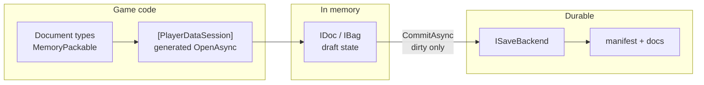
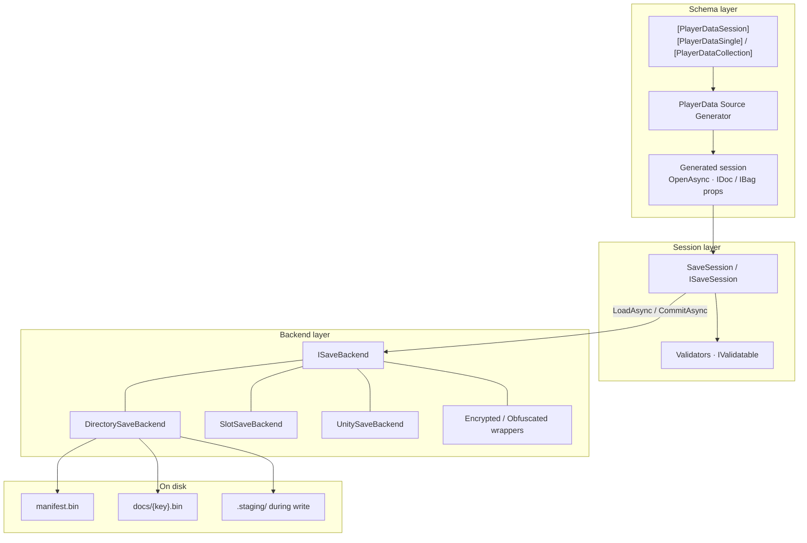

# PlayerData

[](https://github.com/dreamingdog0529/PlayerData/actions) [](https://github.com/dreamingdog0529/PlayerData/releases) [](LICENSE)

English | [日本語](README_ja.md)

Session-centric player save data for .NET and Unity — typed `IDoc` / `IBag` documents, [MemoryPack](https://github.com/Cysharp/MemoryPack) persistence, and multi-document commit behind one clear save boundary.

> [!WARNING]
> **Beta (0.x).** APIs, package surfaces, and generated code may change in **breaking** ways between minor/patch releases. Pin exact versions in production, and expect migration work until 1.0.

PlayerData is for **player save data** (progress the player changes) that outgrows `PlayerPrefs` or a single JSON blob — not read-only master tables (see [MasterSheet](https://github.com/dreamingdog0529/MasterSheet) for those). Save systems have two conflicting needs: **frequent in-memory mutation** and **rare, consistent durable writes**. PlayerData splits that ownership deliberately:

* **Session is the boundary.** Documents compose into one `ISaveSession`; load and commit are session-wide, not per-field ad hoc files.
* **Attributes declare the surface.** `[PlayerDataSession]` + singles/collections are explicit — no reflection auto-discovery of "whatever was on disk."
* **The source generator owns the boilerplate.** `OpenAsync`, typed properties, and `ISaveSession` are generated so call sites stay thin and Unity-friendly (class-level attributes; no partial properties — Unity tops out at C# 12).
* **Memory is a draft; commit is the write.** Updaters may run under CAS; pure functions only. Validation is fail-fast **before** I/O so a bad commit leaves the previous save intact.
* **Backends are swappable.** `ISaveBackend` covers directory, slots, Unity paths, encryption wrappers — session code does not hard-code paths.
* **Adapters stay optional.** R3 / VitalRouter / MessagePipe / VContainer are separate packages; Core stays dependency-light.

In short: **types own shape; the session owns the boundary; the backend owns bytes on disk.**

```
Session (e.g. GameSave)
├── Profile    → IDoc<T>     single value
├── Settings   → IDoc<T>
└── Inventory  → IBag<K,T>   keyed collection
```

In-memory edits are a draft; `CommitAsync` validates, serializes **dirty documents only**, and writes through the backend. Commit is a no-op when not dirty.



Getting Started
---
This library is distributed via NuGet, targeting .NET Standard 2.1. Unity is supported via UPM ([Unity](#unity)).

```bash
dotnet add package PlayerData.Core
# optional adapters
dotnet add package PlayerData.R3
dotnet add package PlayerData.VitalRouter
dotnet add package PlayerData.MessagePipe
```

| Item | Requirement |
| --- | --- |
| Libraries | .NET Standard 2.1 |
| MemoryPack | 1.21.4+ |
| C# | `partial` classes |
| Unity (optional) | Unity 6+ UPM; install Core via [NuGetForUnity](https://github.com/GlitchEnzo/NuGetForUnity) **first** |

First, mark document types with MemoryPack:

```csharp
using MemoryPack;
using PlayerData;

[MemoryPackable(GenerateType.VersionTolerant)]
public partial record PlayerProfile(
    [property: MemoryPackOrder(0)] int Level,
    [property: MemoryPackOrder(1)] string Name)
{
    public static PlayerProfile NewGame() => new(1, "Hero");
}

[MemoryPackable(GenerateType.VersionTolerant)]
public partial record InventoryItem(
    [property: MemoryPackOrder(0), PlayerDataKey] string ItemId,
    [property: MemoryPackOrder(1)] int Count);
```

* Documents must be version-tolerant class types
* Collection entities need **exactly one** `[PlayerDataKey]`

Next, declare the session. Do not hand-write document properties; the source generator owns them.

```csharp
[PlayerDataSession]
[PlayerDataSingle(typeof(PlayerProfile), "Profile", Default = nameof(PlayerProfile.NewGame))]
[PlayerDataCollection(typeof(InventoryItem), "Inventory")]
public partial class GameSave { }
// → Profile: IDoc<PlayerProfile>, Inventory: IBag<string, InventoryItem>
```

Then open, mutate, and commit:

```csharp
await using var save = await GameSave.OpenAsync(new DirectorySaveBackend(path));

using (save.SuppressNotifications())
{
    save.Profile.Update(p => p with { Level = p.Level + 1 });
    save.Inventory.Upsert(new InventoryItem("potion", 1));
}

await save.CommitAsync();
```

| API | Behavior |
| --- | --- |
| `OpenAsync` | Construct + one `LoadAsync` |
| `Update` etc. | Memory only |
| `CommitAsync` | Validate → write; on failure disk unchanged, stays dirty |

Session and Documents
---
| Term | Meaning |
| --- | --- |
| Session | The open save as a whole (`ISaveSession` / generated `GameSave`) |
| Document | One unit inside the session (profile, inventory, …) |
| `IDoc<T>` | Single-value store: `Value` / `Update` / `Replace` |
| `IBag<TKey,T>` | Keyed collection: `Upsert` / `Update` / `Remove` … |
| dirty | User writes since last successful commit |
| Backend | `ISaveBackend` (directory, slots, Unity path, …) |

### Session attributes

```csharp
[PlayerDataSession]
[PlayerDataSingle(typeof(PlayerProfile), "Profile", Default = nameof(PlayerProfile.NewGame))]
[PlayerDataSingle(typeof(Settings), "Settings")]
[PlayerDataCollection(typeof(InventoryItem), "Inventory", Key = "inv")]
public partial class GameSave { }
```

| Attribute | Role |
| --- | --- |
| `[PlayerDataSession]` | Session; optional `AutoCommitOnDispose` |
| `[PlayerDataSingle(typeof(T), name)]` | `IDoc<T>`; `Default` = static factory, else public parameterless ctor |
| `[PlayerDataCollection(typeof(T), name)]` | `IBag<TKey,T>`; key type from `[PlayerDataKey]` |
| `Key = "..."` | Override storage key (default = property name) |

Generator rules: valid identifiers; unique property names and storage keys; no clash with reserved members (`IsDirty`, `LoadAsync`, `OpenAsync`, …); class must be `partial` (**PD0008–PD0012**, **PD0006**).

### `IDoc` / `IBag`

```csharp
// IDoc
var level = save.Profile.Value.Level;
save.Profile.Update(p => p with { Level = p.Level + 1 });
save.Profile.Replace(PlayerProfile.NewGame());

// IBag
save.Inventory.Upsert(new InventoryItem("potion", 3));
save.Inventory.Set("potion", new InventoryItem("potion", 5)); // key == keySelector(entity)
save.Inventory.Update("potion", i => i with { Count = i.Count + 1 });
save.Inventory.TryGet("potion", out var potion);
var snap = save.Inventory.Snapshot;
```

**Contracts**

* `Update` updaters must be **pure** (CAS may re-run them)
* `Set` enforces key == entity key
* Store `Changed` is **user writes only**; use session `Loaded` after load
* `IBag.Snapshot`: weakly consistent live view (not a frozen immutable snapshot)

State-threading overloads avoid capturing closures; existing `Func<T,T>` overloads remain:

```csharp
int delta = 3;
save.Profile.Update(delta, (d, p) => p with { Level = p.Level + d });
save.Inventory.GetOrAdd("potion", 1, (key, n) => new InventoryItem(key, n));
```

### Manual session

```csharp
var session = new SaveSession(new DirectorySaveBackend(path));
var profile = session.AddDocument("Profile", PlayerProfile.NewGame);
var inventory = session.AddCollection<string, InventoryItem>("Inventory", i => i.ItemId);
await session.LoadAsync();
profile.Update(p => p with { Level = 2 });
await session.CommitAsync();
```

### Suppress notifications

```csharp
using (save.SuppressNotifications())
{
    save.Profile.Update(p => p with { Level = 5 });
    save.Inventory.Upsert(new InventoryItem("key", 1));
} // coalesced flush of Changed / DirtyChanged on dispose
```

Commit and Validation
---
Validation is fail-fast **before** I/O. On failure: disk untouched, session stays dirty.

```csharp
public sealed class GuardedData : IValidatable
{
    public int Value { get; init; }
    public void Validate()
    {
        if (Value < 0) throw new SaveValidationException("Value must be non-negative.");
    }
}

save.AddValidator(session => { /* throw to abort */ });
save.AddValidator(new MyValidator()); // ISaveValidator
```

Lifecycle members:

| Member | When |
| --- | --- |
| `LoadAsync` → `LoadResult` | `Found=false` keeps constructor defaults |
| `Loaded` | After load (including not found) |
| `CommitAsync` / `Committed` | Write only when dirty; after success |
| `DirtyChanged` | Dirty flag transitions |
| `IsLoaded` / `IsDirty` | State queries |

`AutoCommitOnDispose` commits on dispose when set; default `false`. Prefer explicit `CommitAsync` when write timing must be controlled.

```csharp
[PlayerDataSession(AutoCommitOnDispose = true)]
public partial class GameSave { }
```

Save Backends
---
| Implementation | Layout |
| --- | --- |
| `DirectorySaveBackend` | `{root}/manifest.bin`, `{root}/docs/{key}.bin` (via `.staging`) |
| `SlotSaveBackend` | `{root}/slot_{n}/…` |
| `UnitySaveBackend` | Under `Application.persistentDataPath` |
| `EncryptedSaveBackend` | Wraps another `ISaveBackend`; AES-256-CBC + HMAC-SHA256 |
| `ObfuscatedSaveBackend` | Wraps another `ISaveBackend`; fixed XOR, not a security feature |
| `CompressedSaveBackend` | Wraps another `ISaveBackend`; Deflate compression per document |
| Custom | `ISaveBackend` |

Save slots:

```csharp
await using var save = await GameSave.OpenAsync(new SlotSaveBackend(rootPath, slot: 0));
// Unity: UnitySaveBackend.Create(slot: 1)
```

A custom backend implements two methods:

```csharp
public interface ISaveBackend
{
    ValueTask<SaveBundle?> ReadAsync(CancellationToken cancellationToken = default); // null = none
    ValueTask WriteAsync(SaveBundle bundle, CancellationToken cancellationToken = default);
}
```

### Encryption, Obfuscation & Compression

These wrap any `ISaveBackend` and transform each document's bytes on write/read; nothing about `SaveSession` / `IDoc` / `IBag` changes.

```csharp
// Real confidentiality + tamper detection (AES-256-CBC + HMAC-SHA256, Encrypt-then-MAC).
var backend = new EncryptedSaveBackend(new DirectorySaveBackend(path), key); // byte[] or passphrase
await using var save = await GameSave.OpenAsync(backend);
```

```csharp
// Deters casual tampering only — no key, no security claim.
var backend = new ObfuscatedSaveBackend(new DirectorySaveBackend(path));
```

```csharp
// Smaller on-disk documents (raw Deflate). Optional CompressionLevel; default is Fastest
// (fast writes, negligible size cost on real save data). Pass Optimal for the smallest payload.
var backend = new CompressedSaveBackend(new DirectorySaveBackend(path));
// var backend = new CompressedSaveBackend(inner, CompressionLevel.Optimal);
```

When combining compression with encryption, **compress first, then encrypt** so the compressor sees structured plaintext (ciphertext does not compress well):

```csharp
var backend = new EncryptedSaveBackend(
    new CompressedSaveBackend(new DirectorySaveBackend(path)),
    key);
```

| | `EncryptedSaveBackend` | `ObfuscatedSaveBackend` | `CompressedSaveBackend` |
| --- | --- | --- | --- |
| Key | `byte[]` or `string` passphrase, caller-supplied | None | None |
| Confidentiality | Yes (AES-256-CBC) | No — reversible without any secret | No |
| Tamper detection | Yes (`SaveTamperDetectedException` on mismatch) | No | No (corrupt payload → `InvalidDataException`) |
| Use when | Real protection against save editing or data extraction is required | You just don't want plain values visible in a hex/text editor | You want smaller save files |

Key/passphrase generation, storage, and rotation are the caller's responsibility; `PlayerData.Core` never persists or manages them. Only each document's byte value is transformed — document keys and `DirectorySaveBackend`'s `manifest.bin` / file names stay in plaintext (so a document's type name may still be inferable from its file name; `EncryptedSaveBackend` does bind the document key into its HMAC, so swapping ciphertext between documents is still detected). Unity + VContainer: pass `wrapBackend` to `RegisterPlayerDataSession` (see [VContainer](#vcontainer)).

Migrations
---
Applied on load when on-disk version &lt; `SaveSession.CurrentFormatVersion`.

```csharp
public sealed class V1ToV2Migration : ISaveMigration
{
    public int FromVersion => 1;
    public int ToVersion => 2;
    public SaveBundle Migrate(SaveBundle bundle) => /* transform */ bundle;
}

await using var save = await GameSave.OpenAsync(backend, migrations: new[] { new V1ToV2Migration() });
```

Adding fields often works with MemoryPack alone. Unknown document keys on disk are ignored (forward-compatible).

Source Generator
---
The Roslyn source generator ships as an analyzer inside `PlayerData.Core`; consumers get it just by referencing the package. Diagnostics are **errors** (fail-closed) — no session members are emitted until fixed.

| ID | When | Fix |
| --- | --- | --- |
| **PD0001** | Missing version-tolerant MemoryPackable | `[MemoryPackable(GenerateType.VersionTolerant)]` on document types |
| **PD0002** | Not exactly one `[PlayerDataKey]` | One key property on collection entities |
| **PD0005** | Cannot resolve Default / parameterless ctor | `Default = nameof(...)` or public parameterless ctor |
| **PD0006** | Duplicate storage key | Unique `Key` / property names |
| **PD0008–PD0010** | Bad / duplicate / reserved property name | Rename; avoid `IsDirty`, `OpenAsync`, … |
| **PD0011** | Non-concrete or open type | Closed concrete document types |
| **PD0012** | Session not `partial` | `public partial class GameSave` |

`PD0003` / `PD0004` / `PD0007` are reserved / unused (class-level attributes only).

Runtime troubleshooting:

| Situation | Fix |
| --- | --- |
| Update but file unchanged | Call `CommitAsync` |
| UI stale after load | Use session `Loaded`, not store `Changed` |
| Commit throws | Validation failed; disk still previous save |
| Unity missing types | Install NuGet **Core before** UPM |
| Hand-wrote `IDoc` properties on session | Attributes only — let the generator emit members |
| Tamper / decrypt failure | Wrong key, or use `ObfuscatedSaveBackend` only when no security claim is needed |

Extension Packages
---
| Package | Role |
| --- | --- |
| [PlayerData.Core](src/PlayerData.Core/) | **Required.** Runtime + source generator |
| [PlayerData.SourceGenerator](src/PlayerData.SourceGenerator/) | Dev; consumers get it via Core |
| [PlayerData.R3](src/PlayerData.R3/) | Observables |
| [PlayerData.VitalRouter](src/PlayerData.VitalRouter/) | VitalRouter commands |
| [PlayerData.MessagePipe](src/PlayerData.MessagePipe/) | MessagePipe publish |
| [PlayerData.Unity](src/PlayerData.Unity/Assets/PlayerData.Unity/) | `UnitySaveBackend` / `PlayerDataAutoSave` (UPM) |
| [PlayerData.Unity.VContainer](src/PlayerData.Unity/Assets/External/PlayerData.Unity.VContainer/) | `RegisterPlayerDataSession` (UPM, optional) |

### R3

```csharp
using PlayerData.R3;
save.Profile.AsObservable().Subscribe(/* default: replay current */);
save.Profile.AsObservable(replayCurrent: false);
save.Profile.AsChangeObservable();
save.Inventory.AsObservable();
```

### VitalRouter / MessagePipe

```csharp
// VitalRouter: PlayerDataChangedCommand<T> (document types need not implement ICommand)
save.Profile.PublishChangesTo(publisher);

// MessagePipe: IPublisher<T> or IPublisher<DocChange<T>>
save.Profile.PublishChangesTo(publisher);
```

Platform Supports
---
### Unity

Minimum supported Unity version is 6000.0. Install `PlayerData.Core` (and MemoryPack) from NuGet via [NuGetForUnity](https://github.com/GlitchEnzo/NuGetForUnity) **first**, then add the UPM package by git URL:

```
https://github.com/dreamingdog0529/PlayerData.git?path=src/PlayerData.Unity/Assets/PlayerData.Unity
```

```csharp
var backend = UnitySaveBackend.Create();
var slot1   = UnitySaveBackend.Create(slot: 1);

await using var save = await GameSave.OpenAsync(backend);

var auto = gameObject.AddComponent<PlayerDataAutoSave>();
auto.IntervalSeconds = 30f;
auto.CommitOnPause = auto.CommitOnQuit = true;
auto.Bind(save); // dirty only; concurrent commits gated
```

### Save Data Viewer (Editor)

`Window > PlayerData > Data Viewer` opens an editor window for inspecting and editing save data. The **Source** dropdown selects where the data comes from: **Disk** (the default) reads save files, and any registered live session (below) edits the running game directly.

**Disk** shows saved data (`DirectorySaveBackend` layout, `slot_{n}` included) without entering play mode: pick your `[PlayerDataSession]` type, set the root path (defaults to `Application.persistentDataPath`), **Scan**, then select a save and a document. **Open Folder** reveals the selected save's directory (or the scan root) in the OS file browser.

**Live sessions** are opt-in — register your session and it appears in the **Source** dropdown during play mode:

```csharp
await using var save = await GameSave.OpenAsync(backend);

// Safe without #if UNITY_EDITOR: in player builds Register stores nothing and
// returns a shared no-op token, so game code pays zero overhead.
IDisposable viewerToken = LiveSessionRegistry.Register("Main Save", save);

// On teardown, alongside closing the session:
viewerToken.Dispose();
```

Live mode lists the session's documents — single docs and collections. Collections get an entry list with **Add Entry** / **Remove Entry** plus per-entry JSON editing. All edits go through the session's own APIs (`IDoc<T>.Replace`, `IBag<TKey,T>.Set/Upsert/Remove`), so the game receives them as ordinary `Changed` events (`DataChangeCause.UserWrite`). The display auto-refreshes (throttled to roughly twice a second) while the game mutates data, but never overwrites your unapplied edits — a stale hint appears instead until you **Apply** or **Revert**. Stopping play mode removes all live sources and the viewer falls back to **Disk**.

The selected document is edited on two tabs. **Fields** (the default) builds type-aware inline editors for the document's top-level members; the **JSON** tab edits the whole payload as text. Disk collection payloads are JSON-tab only.

| Member type | Fields editor |
| --- | --- |
| `bool` | Toggle |
| `string` | Text field |
| Numeric (`int`, `float`, `decimal`, …) | Validated text — invalid input turns red and blocks Apply |
| Enum | Dropdown |
| Anything else (nested objects, lists, `DateTime`, nullable, …) | Read-only preview with an "Edit via JSON tab" hint |

The **Search** field filters the document list by case-insensitive substring over storage key / property name / type name. Unapplied changes show as a trailing `*` in the info label; **Apply** / **Revert** are enabled only while there are unapplied changes.

Safety rules:

- A disk document is editable only when its `bytes → JSON → bytes` round-trip reproduces the payload exactly; documents that JSON cannot represent losslessly (e.g. written by a newer schema) are view-only.
- Encrypted / obfuscated saves cannot be decoded by the viewer and show as *unreadable*. Unknown keys are preserved untouched on write-back.
- Saves whose `FormatVersion` differs from the current one are view-only — run your migrations in game code first.
- Applying to disk during play mode asks for confirmation; a live session's next commit wins over your edit.
- **Applied edits take effect immediately and cannot be undone** — on disk they overwrite the save file; in live mode they mutate the running game's state.
- The key of an existing collection entry cannot be changed by editing the entry (rejected with an error) — use **Add Entry** / **Remove Entry** instead.
- Live documents whose values cannot round-trip through JSON are view-only, with the reason shown in the info label.

### VContainer

Optional [VContainer](https://github.com/hadashiA/VContainer) integration. If you do not use VContainer, install only `PlayerData.Unity` — do not add this package.

Add **both** PlayerData packages (plus VContainer itself) to `Packages/manifest.json`:

```json
"com.dreamingdog0529.playerdata": "https://github.com/dreamingdog0529/PlayerData.git?path=src/PlayerData.Unity/Assets/PlayerData.Unity",
"com.dreamingdog0529.playerdata.vcontainer": "https://github.com/dreamingdog0529/PlayerData.git?path=src/PlayerData.Unity/Assets/External/PlayerData.Unity.VContainer",
"jp.hadashikick.vcontainer": "https://github.com/hadashiA/VContainer.git?path=VContainer/Assets/VContainer#1.19.0"
```

```csharp
using PlayerData.Unity;
using VContainer;

// In LifetimeScope.Configure:
// Registers ISaveBackend (UnitySaveBackend) + GameSave singleton, then LoadAsync on IAsyncStartable.
builder.RegisterPlayerDataSession<GameSave>(relativeFolder: "PlayerData", slot: 0);

// With EncryptedSaveBackend / ObfuscatedSaveBackend layered on top of UnitySaveBackend:
builder.RegisterPlayerDataSession<GameSave>(
    relativeFolder: "PlayerData",
    wrapBackend: b => new EncryptedSaveBackend(b, key));
```

Architecture
---


| Layer | Player device |
| --- | --- |
| Core + generated session | **Yes** (runtime) |
| R3 / VitalRouter / MessagePipe | Optional adapters |
| Unity Runtime / VContainer | Hosting layer |
| SourceGenerator project | Dev only (analyzer via Core) |

**On disk (`DirectorySaveBackend`)**

```
{root}/manifest.bin
{root}/docs/{key}.bin
{root}/.staging/   # during write only
```

Stage → promote docs → replace manifest. Mid-write crash tends to leave the previous consistent save.

**Repository layout / building**

```
src/       PlayerData.Core and adapter libraries; src/PlayerData.Unity is a Unity project
tests/     unit + source generator integration tests
sandbox/   BenchmarkDotNet project
```

```bash
dotnet build src/PlayerData.Core/PlayerData.Core.csproj   # packs Core into the local feed
dotnet build PlayerData.slnx
dotnet test PlayerData.slnx
```

Integration tests consume the packed Core nupkg from `../.local-feed` (see `nuget.config`), so build Core once before restoring the full solution.

The Unity project (`src/PlayerData.Unity`) restores its precompiled DLLs via NuGetForUnity; the binaries under `Assets/Packages/` are not committed. Restore them once before opening the project:

```bash
dotnet build src/PlayerData.Core/PlayerData.Core.csproj   # pack Core into the local feed first
dotnet tool install --global NuGetForUnity.Cli
nugetforunity restore src/PlayerData.Unity
```

Unity EditMode tests run from the Test Runner window, or headless via `Unity.exe -batchmode -projectPath src/PlayerData.Unity -runTests -testPlatform EditMode -testResults <xml> -logFile <log>`.

License
---
This library is under the MIT License.
