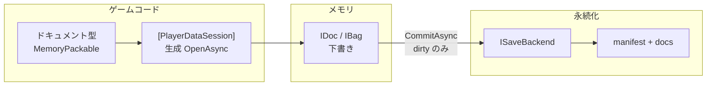
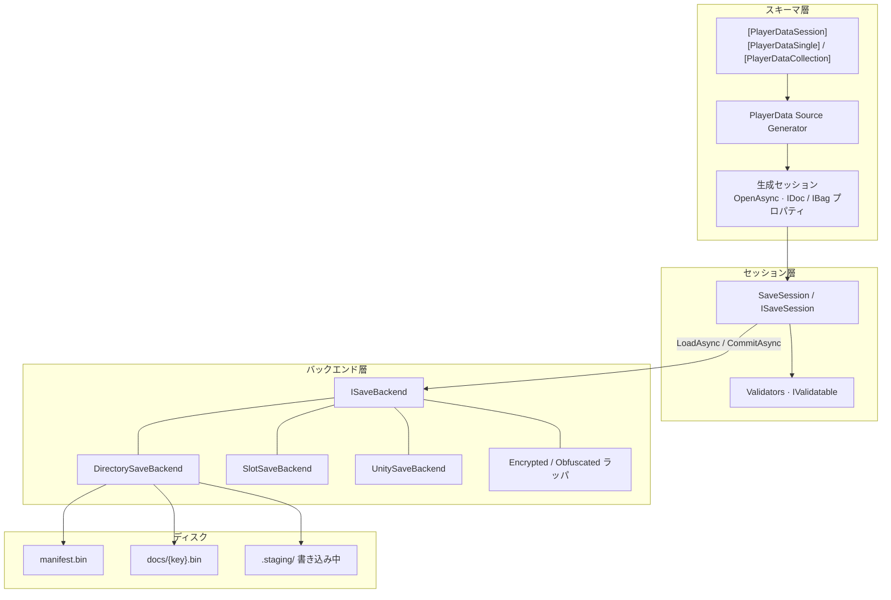

# PlayerData

[](https://github.com/dreamingdog0529/PlayerData/actions) [](https://github.com/dreamingdog0529/PlayerData/releases) [](LICENSE)

[English](README.md) | 日本語

.NET / Unity 向けのセッション単位プレイヤーセーブ — 型付き `IDoc` / `IBag` ドキュメント、[MemoryPack](https://github.com/Cysharp/MemoryPack) 永続化、そして 1 つの明確なセーブ境界の背後での複数ドキュメント一括コミット。

> [!WARNING]
> **ベータ（0.x）です。** API・パッケージ境界・生成コードはマイナー/パッチ間でも **破壊的に変更** されることがあります。本番ではバージョンを厳密に固定し、1.0 までは移行コストを見込んでください。

PlayerData は `PlayerPrefs` や単一 JSON では手狭になった **プレイヤーセーブ**（プレイヤーが書き換える進行）向けです。読み取り専用のマスタ表は対象外です（そちらは [MasterSheet](https://github.com/dreamingdog0529/MasterSheet) を参照）。セーブには **頻繁なメモリ更新** と **まれで一貫した永続化** という相反する要求があり、PlayerData はその所有権を意図的に分けます。

* **セッションが境界。** ドキュメントは 1 つの `ISaveSession` に合成。ロードとコミットはセッション単位であり、フィールドごとのアドホックなファイル操作ではない。
* **属性が面を宣言する。** `[PlayerDataSession]` + Single/Collection は明示的 — 「ディスクにあったもの」の自動発見はしない。
* **ソースジェネレータが定型を担う。** `OpenAsync`・型付きプロパティ・`ISaveSession` を生成し、呼び出し側を薄く保つ（クラスレベル属性。partial property は使わない — Unity は C# 12 まで）。
* **メモリは下書き、コミットが書き込み。** updater は CAS 下で再実行され得るので純粋関数のみ。検証は I/O 前に fail-fast し、失敗時は直前セーブを残す。
* **バックエンドは差し替え可能。** `ISaveBackend` がディレクトリ・スロット・Unity パス・暗号ラッパを担当し、セッションはパスを直書きしない。
* **アダプタは任意。** R3 / VitalRouter / MessagePipe は別パッケージ。VContainer 統合は `PlayerData.Unity` 内に同梱され、VContainer 導入時に自動有効化される。Core は依存を薄く保つ。

要するに: **型が形を持ち、セッションが境界を持ち、バックエンドがディスク上のバイトを持つ。**

```
セッション（例: GameSave）
├── Profile    → IDoc<T>     常に 1 つ
├── Settings   → IDoc<T>
└── Inventory  → IBag<K,T>   キー付きコレクション
```

メモリ変更は下書きであり、`CommitAsync` が検証 → **dirty のみ** シリアライズ → バックエンド書き込みを行います。dirty でなければコミットは no-op です。



Getting Started
---
本ライブラリは NuGet で配布され、.NET Standard 2.1 をターゲットにしています。Unity は UPM で対応します（[Unity](#unity)）。

```bash
dotnet add package PlayerData.Core
# 任意アダプタ
dotnet add package PlayerData.R3
dotnet add package PlayerData.VitalRouter
dotnet add package PlayerData.MessagePipe
```

| 項目 | 要件 |
| --- | --- |
| ライブラリ | .NET Standard 2.1 |
| MemoryPack | 1.21.4+ |
| C# | `partial` クラス |
| Unity（任意） | Unity 6+ UPM。Core は [NuGetForUnity](https://github.com/GlitchEnzo/NuGetForUnity) 等で **先に** 導入 |

まず、ドキュメント型に MemoryPack を付与します。

```csharp
using MemoryPack;
using PlayerData;

[MemoryPackable(GenerateType.VersionTolerant)]
public partial record PlayerProfile(
    [property: MemoryPackOrder(0)] int Level,
    [property: MemoryPackOrder(1)] string Name)
{
    public static PlayerProfile NewGame() => new(1, "Hero");
}

[MemoryPackable(GenerateType.VersionTolerant)]
public partial record InventoryItem(
    [property: MemoryPackOrder(0), PlayerDataKey] string ItemId,
    [property: MemoryPackOrder(1)] int Count);
```

* ドキュメントは version-tolerant な class 型
* コレクション要素には `[PlayerDataKey]` を **ちょうど 1 つ**

次に、セッションを宣言します。プロパティは手書きしません — ソースジェネレータが実装します。

```csharp
[PlayerDataSession]
[PlayerDataSingle(typeof(PlayerProfile), "Profile", Default = nameof(PlayerProfile.NewGame))]
[PlayerDataCollection(typeof(InventoryItem), "Inventory")]
public partial class GameSave { }
// → Profile: IDoc<PlayerProfile>, Inventory: IBag<string, InventoryItem>
```

あとは開いて、更新して、コミットするだけです。

```csharp
await using var save = await GameSave.OpenAsync(new DirectorySaveBackend(path));

using (save.SuppressNotifications())
{
    save.Profile.Update(p => p with { Level = p.Level + 1 });
    save.Inventory.Upsert(new InventoryItem("potion", 1));
}

await save.CommitAsync();
```

| API | 挙動 |
| --- | --- |
| `OpenAsync` | 生成 + 1 回 `LoadAsync` |
| `Update` 等 | メモリのみ。ファイルは触らない |
| `CommitAsync` | 検証 → 書き込み。失敗時ディスク不変・dirty 維持 |

セッションとドキュメント
---
| 用語 | 意味 |
| --- | --- |
| セッション | 開いているセーブ全体（`ISaveSession` / 生成された `GameSave` など） |
| ドキュメント | セッション内の 1 単位（プロフィール、インベントリ…） |
| `IDoc<T>` | 単一値ストア。`Value` / `Update` / `Replace` |
| `IBag<TKey,T>` | キー付きコレクション。`Upsert` / `Update` / `Remove` … |
| dirty | 最終成功コミット以降にユーザー書き込みがある状態 |
| バックエンド | `ISaveBackend` 実装（ディレクトリ、スロット、Unity パスなど） |

### セッション属性

```csharp
[PlayerDataSession]
[PlayerDataSingle(typeof(PlayerProfile), "Profile", Default = nameof(PlayerProfile.NewGame))]
[PlayerDataSingle(typeof(Settings), "Settings")]
[PlayerDataCollection(typeof(InventoryItem), "Inventory", Key = "inv")]
public partial class GameSave { }
```

| 属性 | 役割 |
| --- | --- |
| `[PlayerDataSession]` | セッション。任意 `AutoCommitOnDispose` |
| `[PlayerDataSingle(typeof(T), name)]` | `IDoc<T>`。`Default` = static ファクトリ名、省略時は public 引数なし ctor |
| `[PlayerDataCollection(typeof(T), name)]` | `IBag<TKey,T>`。キー型は `[PlayerDataKey]` から |
| `Key = "..."` | 保存キー上書き（既定はプロパティ名） |

ジェネレータ制約: 識別子として有効なプロパティ名、セッション内でプロパティ名 / 保存キー一意、予約名（`IsDirty` / `LoadAsync` / `OpenAsync` 等）との非衝突、`partial` 必須（**PD0008–PD0012**, **PD0006**）。

### `IDoc` / `IBag`

```csharp
// IDoc
var level = save.Profile.Value.Level;
save.Profile.Update(p => p with { Level = p.Level + 1 });
save.Profile.Replace(PlayerProfile.NewGame());

// IBag
save.Inventory.Upsert(new InventoryItem("potion", 3));
save.Inventory.Set("potion", new InventoryItem("potion", 5)); // key == keySelector(entity)
save.Inventory.Update("potion", i => i with { Count = i.Count + 1 });
save.Inventory.TryGet("potion", out var potion);
var snap = save.Inventory.Snapshot;
```

**契約**

* `Update` の updater は **純粋**（CAS で再実行され得る）
* `Set` は key とエンティティ内キーの一致を強制
* ストア `Changed` は **ユーザー書き込みのみ**。ロード完了はセッション `Loaded`
* `Snapshot`（`IBag`）: 実装により弱一貫性のライブビュー（点時点の immutable コピーではない）

クロージャ確保を避ける状態スレッディングオーバーロードもあります。既存 `Func<T,T>` はそのまま。

```csharp
int delta = 3;
save.Profile.Update(delta, (d, p) => p with { Level = p.Level + d });
save.Inventory.GetOrAdd("potion", 1, (key, n) => new InventoryItem(key, n));
```

### 手動セッション

```csharp
var session = new SaveSession(new DirectorySaveBackend(path));
var profile = session.AddDocument("Profile", PlayerProfile.NewGame);
var inventory = session.AddCollection<string, InventoryItem>("Inventory", i => i.ItemId);
await session.LoadAsync();
profile.Update(p => p with { Level = 2 });
await session.CommitAsync();
```

### 通知抑制

```csharp
using (save.SuppressNotifications())
{
    save.Profile.Update(p => p with { Level = 5 });
    save.Inventory.Upsert(new InventoryItem("key", 1));
} // dispose 時に Changed / DirtyChanged を合流フラッシュ
```

コミットと検証
---
検証は I/O 前に fail-fast します。失敗時はディスク非更新・dirty 維持です。

```csharp
public sealed class GuardedData : IValidatable
{
    public int Value { get; init; }
    public void Validate()
    {
        if (Value < 0) throw new SaveValidationException("Value must be non-negative.");
    }
}

save.AddValidator(session => { /* throw で中止 */ });
save.AddValidator(new MyValidator()); // ISaveValidator
```

ライフサイクルメンバ:

| メンバ | タイミング |
| --- | --- |
| `LoadAsync` → `LoadResult` | `Found=false` なら初期値のまま |
| `Loaded` | ロード完了（未発見含む） |
| `CommitAsync` / `Committed` | dirty 時のみ書き込み成功後 |
| `DirtyChanged` | dirty フラグ遷移 |
| `IsLoaded` / `IsDirty` | 状態照会 |

`AutoCommitOnDispose` を指定すると dispose 時にコミットします（既定 `false`）。書き込みタイミングを明示したい場合はオフのまま `CommitAsync` を呼んでください。

```csharp
[PlayerDataSession(AutoCommitOnDispose = true)]
public partial class GameSave { }
```

セーブバックエンド
---
| 実装 | 配置 |
| --- | --- |
| `DirectorySaveBackend` | `{root}/manifest.bin`, `{root}/docs/{key}.bin`（`.staging` 経由） |
| `SlotSaveBackend` | `{root}/slot_{n}/…` |
| `UnitySaveBackend` | `Application.persistentDataPath` 下（Unity パッケージ） |
| `EncryptedSaveBackend` | 他の `ISaveBackend` をラップ。AES-256-CBC + HMAC-SHA256 |
| `ObfuscatedSaveBackend` | 他の `ISaveBackend` をラップ。固定XOR、セキュリティ機能ではない |
| `CompressedSaveBackend` | 他の `ISaveBackend` をラップ。ドキュメント単位の Deflate 圧縮 |
| カスタム | `ISaveBackend` |

セーブスロット:

```csharp
await using var save = await GameSave.OpenAsync(new SlotSaveBackend(rootPath, slot: 0));
// Unity: UnitySaveBackend.Create(slot: 1)
```

カスタムバックエンドは 2 メソッドを実装するだけです。

```csharp
public interface ISaveBackend
{
    ValueTask<SaveBundle?> ReadAsync(CancellationToken cancellationToken = default); // null = 無し
    ValueTask WriteAsync(SaveBundle bundle, CancellationToken cancellationToken = default);
}
```

### 暗号化・難読化・圧縮

いずれも任意の `ISaveBackend` をラップし、書き込み/読み込み時に各ドキュメントのバイト列を変換します。`SaveSession` / `IDoc` / `IBag` 側は一切変わりません。

```csharp
// 本格的な機密性 + 改ざん検知(AES-256-CBC + HMAC-SHA256、Encrypt-then-MAC)。
var backend = new EncryptedSaveBackend(new DirectorySaveBackend(path), key); // byte[] または passphrase
await using var save = await GameSave.OpenAsync(backend);
```

```csharp
// カジュアルな改変の抑止のみ — 鍵不要、セキュリティ機能ではない。
var backend = new ObfuscatedSaveBackend(new DirectorySaveBackend(path));
```

```csharp
// ディスク上のドキュメントを小さくする(raw Deflate)。CompressionLevel は任意、既定は Fastest
// (書き込みが速く、実データではサイズ差はごくわずか)。最小サイズが必要なら Optimal を指定。
var backend = new CompressedSaveBackend(new DirectorySaveBackend(path));
// var backend = new CompressedSaveBackend(inner, CompressionLevel.Optimal);
```

圧縮と暗号化を併用する場合は、**先に圧縮してから暗号化する**のが推奨です(暗号文はエントロピーが高く圧縮しにくいため)。

```csharp
var backend = new EncryptedSaveBackend(
    new CompressedSaveBackend(new DirectorySaveBackend(path)),
    key);
```

| | `EncryptedSaveBackend` | `ObfuscatedSaveBackend` | `CompressedSaveBackend` |
| --- | --- | --- | --- |
| 鍵 | `byte[]` または `string` passphrase(呼び出し側が用意) | なし | なし |
| 機密性 | あり(AES-256-CBC) | なし — 秘密なしで誰でも復元可能 | なし |
| 改ざん検知 | あり(不一致時 `SaveTamperDetectedException`) | なし | なし(破損時は `InvalidDataException`) |
| 使いどころ | セーブ改変やデータ抽出への本格的な防御が必要なとき | 平文の値がテキスト/16進エディタでそのまま見えなければ十分なとき | セーブファイルを小さくしたいとき |

鍵/パスフレーズの生成・保存・ローテーションは呼び出し側の責務であり、`PlayerData.Core` は一切保持・管理しません。変換対象は各ドキュメントのバイト値のみで、ドキュメントキーや `DirectorySaveBackend` の `manifest.bin`・ファイル名は平文のまま残ります(そのためファイル名からドキュメントの型名が推測できる可能性があります。ただし `EncryptedSaveBackend` はドキュメントキーをHMACに束縛しているため、ドキュメント間での暗号文の入れ替えは検知されます)。Unity + VContainer では `RegisterPlayerDataSession` に `wrapBackend` を渡します([VContainer](#vcontainer)参照)。

マイグレーション
---
ディスク版 < `SaveSession.CurrentFormatVersion` のときロード時に連鎖適用されます。

```csharp
public sealed class V1ToV2Migration : ISaveMigration
{
    public int FromVersion => 1;
    public int ToVersion => 2;
    public SaveBundle Migrate(SaveBundle bundle) => /* 変換 */ bundle;
}

await using var save = await GameSave.OpenAsync(backend, migrations: new[] { new V1ToV2Migration() });
```

フィールド追加程度は MemoryPack version-tolerant で足りることが多いです。未登録キーの blob は無視されます（前方互換）。

ソースジェネレータ
---
Roslyn ソースジェネレータは `PlayerData.Core` に analyzer として同梱されており、パッケージ参照だけで利用側に届きます。診断は **エラー**（fail-closed）で、修正するまでセッションメンバは生成されません。

| ID | 条件 | 対処 |
| --- | --- | --- |
| **PD0001** | version-tolerant MemoryPackable 欠如 | ドキュメント型に `[MemoryPackable(GenerateType.VersionTolerant)]` |
| **PD0002** | `[PlayerDataKey]` が 1 つでない | コレクション要素にキーを 1 つ |
| **PD0005** | Default / 引数なし ctor 解決不能 | `Default = nameof(...)` または public 引数なし ctor |
| **PD0006** | 保存キー重複 | `Key` / プロパティ名を一意に |
| **PD0008–PD0010** | プロパティ名不正 / 重複 / 予約衝突 | リネーム。`IsDirty` / `OpenAsync` 等を避ける |
| **PD0011** | 非具象・非クローズ型 | 閉じた具象ドキュメント型 |
| **PD0012** | 非 `partial` | `public partial class GameSave` |

`PD0003` / `PD0004` / `PD0007` は予約・未使用（クラスレベル属性のみ）。

ランタイムのトラブルシューティング:

| 状況 | 対処 |
| --- | --- |
| Update 後ファイル不変 | `CommitAsync` を呼ぶ |
| ロード後 UI 未更新 | ストア `Changed` ではなくセッション `Loaded` |
| コミット例外 | 検証失敗。ディスクは旧セーブのまま |
| Unity で型が無い | **NuGet Core を UPM より先に** |
| セッションに `IDoc` プロパティ手書き | 属性のみ。ジェネレータに任せる |
| 改ざん / 復号失敗 | 鍵の不一致。セキュリティ不要なら `ObfuscatedSaveBackend` のみ検討 |

拡張パッケージ
---
| パッケージ | 用途 |
| --- | --- |
| [PlayerData.Core](src/PlayerData.Core/) | **必須。** ランタイム + ソースジェネレータ |
| [PlayerData.SourceGenerator](src/PlayerData.SourceGenerator/) | 開発用。利用側は Core 経由で取得 |
| [PlayerData.R3](src/PlayerData.R3/) | `Observable` 化 |
| [PlayerData.VitalRouter](src/PlayerData.VitalRouter/) | VitalRouter コマンド発行 |
| [PlayerData.MessagePipe](src/PlayerData.MessagePipe/) | MessagePipe 発行 |
| [PlayerData.Unity](src/PlayerData.Unity/Assets/PlayerData.Unity/) | `UnitySaveBackend` / `PlayerDataAutoSave` / 任意の VContainer（UPM） |

### R3

```csharp
using PlayerData.R3;
save.Profile.AsObservable().Subscribe(/* 既定: 現在値 replay */);
save.Profile.AsObservable(replayCurrent: false);
save.Profile.AsChangeObservable();
save.Inventory.AsObservable();
```

### VitalRouter / MessagePipe

```csharp
// VitalRouter: PlayerDataChangedCommand<T> 等（ドキュメント型は ICommand 不要）
save.Profile.PublishChangesTo(publisher);

// MessagePipe: IPublisher<T> または IPublisher<DocChange<T>>
save.Profile.PublishChangesTo(publisher);
```

Platform Supports
---
### Unity

サポートする Unity の最小バージョンは 6000.0 です。先に [NuGetForUnity](https://github.com/GlitchEnzo/NuGetForUnity) で `PlayerData.Core`（と MemoryPack）を NuGet から導入し、その後 git URL で UPM パッケージを追加してください。

```
https://github.com/dreamingdog0529/PlayerData.git?path=src/PlayerData.Unity/Assets/PlayerData.Unity
```

```csharp
var backend = UnitySaveBackend.Create();          // …/PlayerData
var slot1   = UnitySaveBackend.Create(slot: 1);

await using var save = await GameSave.OpenAsync(backend);

var auto = gameObject.AddComponent<PlayerDataAutoSave>();
auto.IntervalSeconds = 30f;
auto.CommitOnPause = auto.CommitOnQuit = true;
auto.Bind(save); // dirty 時のみ。並行コミットはゲート
```

### セーブデータビューア（エディタ）

`Window > PlayerData > Data Viewer` でビューアを開き、**Source** ドロップダウンでデータの参照元を切り替えます。**Disk**（既定）はセーブファイルを読み、登録済みのライブセッション（後述）は実行中のゲームを直接編集します。

**Disk** では、再生せずに保存済みデータ（`DirectorySaveBackend` レイアウト、`slot_{n}` 含む）を閲覧・編集できます。`[PlayerDataSession]` 型を選び、ルートパス（既定は `Application.persistentDataPath`）を指定して **Scan** → セーブとドキュメントを選択します。**Open Folder** で選択中セーブのディレクトリ（未選択ならスキャンルート）を OS のファイルブラウザで開けます。

**ライブセッション**はオプトインです。セッションを登録すると、再生中に **Source** ドロップダウンへ現れます:

```csharp
await using var save = await GameSave.OpenAsync(backend);

// #if UNITY_EDITOR は不要: プレイヤービルドでは Register は何も保存せず
// 共有の no-op トークンを返すため、ゲームコード側のオーバーヘッドはゼロ。
IDisposable viewerToken = LiveSessionRegistry.Register("Main Save", save);

// 破棄時にセッションのクローズと合わせて:
viewerToken.Dispose();
```

ライブモードではセッションのドキュメント（単一ドキュメントとコレクション）が一覧されます。コレクションはエントリ一覧に **Add Entry** / **Remove Entry** とエントリ単位の JSON 編集が付きます。編集はすべてセッション自身の API（`IDoc<T>.Replace`、`IBag<TKey,T>.Set/Upsert/Remove`）を経由するため、ゲーム側には通常の `Changed` イベント（`DataChangeCause.UserWrite`）として届きます。ゲームがデータを更新すると表示は自動更新（およそ秒 2 回に間引き）されますが、未 Apply の編集が上書きされることはありません — 代わりに stale ヒントが表示され、**Apply** か **Revert** で解消します。再生を停止するとライブソースは消え、**Disk** に戻ります。

選択中のドキュメントは 2 つのタブで編集します。**Fields**（既定）はトップレベルメンバーごとに型対応のインラインエディタを構築し、**JSON** タブはペイロード全体をテキストで編集します。Disk のコレクションペイロードは JSON タブ専用です。

| メンバー型 | Fields のエディタ |
| --- | --- |
| `bool` | トグル |
| `string` | テキストフィールド |
| 数値型（`int`、`float`、`decimal` など） | 検証付きテキスト — 不正な入力は赤枠になり Apply をブロック |
| enum | ドロップダウン |
| その他（ネストしたオブジェクト、リスト、`DateTime`、nullable など） | 読み取り専用プレビュー +「Edit via JSON tab」ヒント |

**Search** フィールドはドキュメント一覧を絞り込みます（ストレージキー / プロパティ名 / 型名の部分一致、大文字小文字を無視）。未 Apply の変更があると情報ラベル末尾に `*` が付き、**Apply** / **Revert** はその間だけ有効になります。

安全のためのルール:

- Disk のドキュメントで編集できるのは `bytes → JSON → bytes` の往復がバイト一致するもののみです。JSON で無損失に表現できないもの（例: より新しいスキーマで書かれたデータ）は閲覧のみになります。
- 暗号化・難読化されたセーブは復号できず *unreadable* と表示されます。未知のキーは書き戻し時にそのまま保全されます。
- `FormatVersion` が現行と異なるセーブは閲覧のみです（先にゲームコード側でマイグレーションを実行してください）。
- 再生中に Disk へ Apply すると確認ダイアログが出ます。ライブセッションの次のコミットが編集を上書きします（後勝ち）。
- **Apply した編集は即座に反映され、元に戻せません** — Disk ではセーブファイルを上書きし、ライブモードでは実行中のゲームの状態を書き換えます。
- 既存コレクションエントリのキーはエントリ編集では変更できません（エラーとして拒否）。**Add Entry** / **Remove Entry** を使ってください。
- JSON を往復できない値を持つライブドキュメントは閲覧のみになり、理由が情報ラベルに表示されます。

### VContainer

任意の [VContainer](https://github.com/hadashiA/VContainer) 統合は `PlayerData.Unity` **内**に同梱されています（Cysharp 流の `Runtime/External`）。`jp.hadashikick.vcontainer` が導入されていれば、asmdef の version defines により `PlayerData.Unity.VContainer` アセンブリが自動有効化されます — 別の PlayerData パッケージは不要です。VContainer が無い場合、当該アセンブリはコンパイルされません。

`Packages/manifest.json` に PlayerData.Unity（と VContainer 本体）を追加します:

```json
"com.dreamingdog0529.playerdata": "https://github.com/dreamingdog0529/PlayerData.git?path=src/PlayerData.Unity/Assets/PlayerData.Unity",
"jp.hadashikick.vcontainer": "https://github.com/hadashiA/VContainer.git?path=VContainer/Assets/VContainer#1.19.0"
```

```csharp
using PlayerData.Unity;
using VContainer;

// LifetimeScope.Configure 内で:
// ISaveBackend (UnitySaveBackend) + GameSave シングルトンを登録し、IAsyncStartable で LoadAsync する。
builder.RegisterPlayerDataSession<GameSave>(relativeFolder: "PlayerData", slot: 0);

// UnitySaveBackend の上に EncryptedSaveBackend / ObfuscatedSaveBackend を重ねる場合:
builder.RegisterPlayerDataSession<GameSave>(
    relativeFolder: "PlayerData",
    wrapBackend: b => new EncryptedSaveBackend(b, key));
```

アーキテクチャ
---


| 層 | プレイヤー端末 |
| --- | --- |
| Core + 生成セッション | **はい**（ランタイム） |
| R3 / VitalRouter / MessagePipe | 任意アダプタ |
| Unity Runtime / VContainer | ホスト層 |
| SourceGenerator プロジェクト | 開発時のみ（analyzer は Core 経由） |

**ディスク（`DirectorySaveBackend`）**

```
{root}/manifest.bin
{root}/docs/{key}.bin
{root}/.staging/   # 書き込み中のみ
```

ステージ → docs 昇格 → manifest 置換の順。途中クラッシュ時は直前 manifest が一貫状態として残りやすいです。

**リポジトリ構成 / ビルド**

```
src/       PlayerData.Core とアダプタ各ライブラリ。src/PlayerData.Unity は Unity プロジェクト
tests/     ユニットテスト + ソースジェネレータ統合テスト
sandbox/   BenchmarkDotNet プロジェクト
```

```bash
dotnet build src/PlayerData.Core/PlayerData.Core.csproj   # Core をローカルフィードへ pack
dotnet build PlayerData.slnx
dotnet test PlayerData.slnx
```

統合テストは `../.local-feed` の pack 済み Core nupkg を参照します（`nuget.config` 参照）。ソリューション全体を restore する前に Core を一度ビルドしてください。

Unity プロジェクト（`src/PlayerData.Unity`）のプリコンパイル DLL は NuGetForUnity で復元します（`Assets/Packages/` のバイナリはコミットされていません）。プロジェクトを開く前に一度復元してください:

```bash
dotnet build src/PlayerData.Core/PlayerData.Core.csproj   # 先に Core をローカルフィードへ pack
dotnet tool install --global NuGetForUnity.Cli
nugetforunity restore src/PlayerData.Unity
```

Unity の EditMode テストは Test Runner ウィンドウ、またはヘッドレスで `Unity.exe -batchmode -projectPath src/PlayerData.Unity -runTests -testPlatform EditMode -testResults <xml> -logFile <log>` で実行できます。

License
---
このライブラリは MIT ライセンスです。
