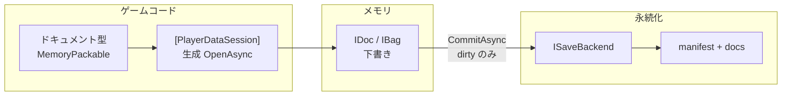
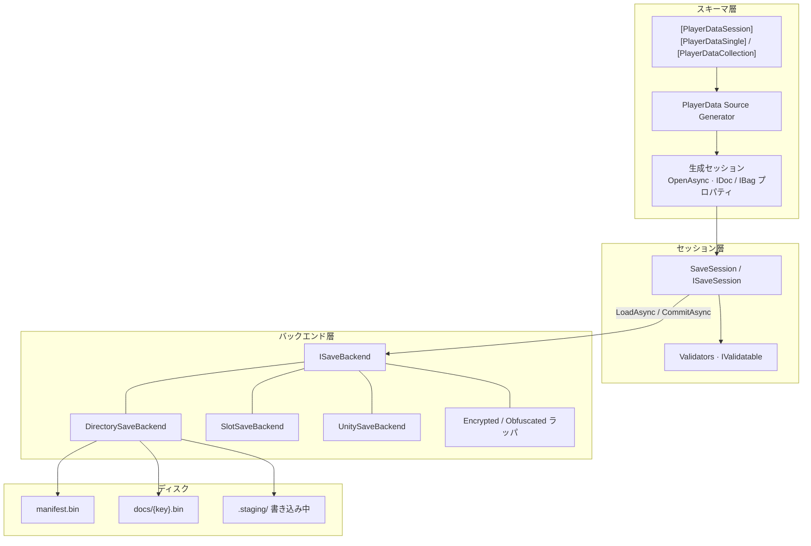

# PlayerData

[English](README.md) | 日本語

> セッション単位のプレイヤーセーブ — 型付き `IDoc` / `IBag`、MemoryPack 永続化、複数ドキュメントの一括コミット。

[](LICENSE)
[](#パッケージ)
[](https://semver.org/#spec-item-4)

> [!WARNING]
> **ベータ（0.x）です。** API・パッケージ境界・生成コードはマイナー/パッチ間でも **破壊的に変更** されることがあります。本番ではバージョンを厳密に固定し、1.0 までは移行コストを見込んでください。

## 目次

<details>
<summary>詳細</summary>

- [概要](#概要)
  - [位置づけ](#位置づけ)
  - [なぜこの設計か](#なぜこの設計か)
  - [用語](#用語)
  - [特徴](#特徴)
  - [パッケージ](#パッケージ)
- [セットアップ](#セットアップ)
- [クイックスタート](#クイックスタート)
- [基本的な使い方](#基本的な使い方)
  - [セッション属性](#セッション属性)
  - [`IDoc` / `IBag`](#idoc--ibag)
  - [手動セッション](#手動セッション)
  - [通知抑制](#通知抑制)
  - [コミット検証](#コミット検証)
  - [バックエンド](#バックエンド)
  - [ライフサイクル](#ライフサイクル)
- [高度な使い方](#高度な使い方)
  - [状態スレッディング更新](#状態スレッディング更新)
  - [セーブスロット](#セーブスロット)
  - [マイグレーション](#マイグレーション)
  - [カスタム `ISaveBackend`](#カスタム-isavebackend)
  - [暗号化と難読化](#暗号化と難読化)
  - [SG 診断](#sg-診断)
  - [AutoCommitOnDispose](#autocommitondispose)
- [拡張パッケージ](#拡張パッケージ)
  - [R3](#r3)
  - [VitalRouter / MessagePipe](#vitalrouter--messagepipe)
  - [Unity](#unity)
  - [Unity + VContainer](#unity--vcontainer)
- [アーキテクチャ](#アーキテクチャ)
- [トラブルシューティング](#トラブルシューティング)
- [ドキュメント](#ドキュメント)
- [貢献](#貢献)
- [ライセンス](#ライセンス)
- [作者](#作者)

</details>

## 概要

### 位置づけ

**プレイヤーセーブ**（プレイヤーが書き換える進行）向けです。`PlayerPrefs` や単一 JSON では手狭になったときの境界を提供します。読み取り専用のマスタ表は [MasterSheet](https://github.com/dreamingdog0529/MasterSheet)（スプレッドシート → MasterMemory）を参照。

よくあるずれ:

| 問題 | 結果 |
| --- | --- |
| セーブ処理がシステム横断で散在 | 読み書き境界が曖昧 |
| 毎回ファイル全体を書き直す | I/O コストと dirty 管理が困難 |
| ディスク上の形が黙って変わる | マイグレーションなしの破損・欠落 |

**PlayerData** は **明確なセーブ境界** を提供します。DB でも ORM でもなく、次を満たす薄いランタイムです。

- 複数ドキュメントを **1 セッション** に合成する
- メモリ上で CAS 的に更新し、`CommitAsync` で **dirty のみ** ディスクへ
- シリアライズは [MemoryPack](https://github.com/Cysharp/MemoryPack)（version-tolerant）

```
セッション（例: GameSave）
├── Profile    → IDoc<T>     常に 1 つ
├── Settings   → IDoc<T>
└── Inventory  → IBag<K,T>  キー付きコレクション
```

メモリ変更は下書き、`CommitAsync` が確定書き込み。dirty でなければコミットは no-op です。

**対象:** Unity / .NET でセーブの読み書き箇所を一本化したいチーム。  
**非対象:** サーバが唯一の真実源であるオンライン専用設計（ローカルキャッシュ用途には使える）。

### なぜこの設計か

セーブには **頻繁なメモリ更新** と **まれで一貫した永続化** という相反する要求があります。

そこで PlayerData は所有権を意図的に分けます。

1. **セッションが境界。** ドキュメントは 1 つの `ISaveSession` に合成。ロードとコミットはセッション単位であり、フィールドごとのアドホックなファイル操作ではない。
2. **属性が面を宣言する。** `[PlayerDataSession]` + Single/Collection は明示的 — 「ディスクにあったもの」の自動発見はしない。
3. **SG が定型を担う。** `OpenAsync`・型付きプロパティ・`ISaveSession` を生成し、呼び出し側を薄く保つ（クラスレベル属性。partial property は使わない — Unity は C# 12 まで）。
4. **メモリは下書き、コミットが書き込み。** updater は CAS 下で再実行され得るので純粋関数のみ。検証は I/O 前に fail-fast し、失敗時は直前セーブを残す。
5. **バックエンドは差し替え可能。** `ISaveBackend` がディレクトリ・スロット・Unity パス・暗号ラッパを担当し、セッションはパスを直書きしない。
6. **アダプタは任意。** R3 / VitalRouter / MessagePipe / VContainer は別パッケージ。Core は依存を薄く保つ。

要するに: **型が形を持ち、セッションが境界を持ち、バックエンドがディスク上のバイトを持つ。**



### 用語

| 用語 | 意味 |
| --- | --- |
| セッション | 開いているセーブ全体（`ISaveSession` / 生成された `GameSave` など） |
| ドキュメント | セッション内の 1 単位（プロフィール、インベントリ…） |
| `IDoc<T>` | 単一値ストア。`Value` / `Update` / `Replace` |
| `IBag<TKey,T>` | キー付きコレクション。`Upsert` / `Update` / `Remove` … |
| dirty | 最終成功コミット以降にユーザー書き込みがある状態 |
| バックエンド | `ISaveBackend` 実装（ディレクトリ、スロット、Unity パスなど） |
| SG | Roslyn ソースジェネレータ（`PlayerData.Core` に analyzer として同梱） |

### 特徴

1. ドキュメント型に MemoryPack を付与  
2. `[PlayerDataSession]` + `[PlayerDataSingle]` / `[PlayerDataCollection]` でセッション面を宣言（クラスレベル属性 — Unity の C# 12 制約に合わせ partial property は使わない）  
3. SG が `OpenAsync`・プロパティ・`ISaveSession` 実装を生成  
4. `CommitAsync` が検証 → dirty のみシリアライズ → backend 書き込み  

```csharp
[PlayerDataSession]
[PlayerDataSingle(typeof(PlayerProfile), "Profile", Default = nameof(PlayerProfile.NewGame))]
[PlayerDataCollection(typeof(InventoryItem), "Inventory")]
public partial class GameSave { }

await using var save = await GameSave.OpenAsync(new DirectorySaveBackend(path));
save.Profile.Update(p => p with { Level = p.Level + 1 });
await save.CommitAsync();
```

| 項目 | 内容 |
| --- | --- |
| 合成 | 属性で明示。自動発見なし |
| 更新 | CAS リトライあり → updater は純粋関数 |
| コミット | dirty-only、fail-fast 検証 |
| 通知 | `SuppressNotifications()` で `Changed` / `DirtyChanged` を遅延・合流 |
| 耐久性 | `DirectorySaveBackend` は staging + manifest 昇格 |
| スロット / 移行 | `SlotSaveBackend`、`ISaveMigration` |
| アダプタ | R3 / VitalRouter / MessagePipe、Unity UPM + VContainer |
| ターゲット | .NET Standard 2.1 |

### パッケージ

| パッケージ | 用途 |
| --- | --- |
| [PlayerData.Core](PlayerData.Core/) | **必須。** ランタイム + SG |
| [PlayerData.SourceGenerator](PlayerData.SourceGenerator/) | 開発用。利用側は Core 経由で取得 |
| [PlayerData.R3](PlayerData.R3/) | `Observable` 化 |
| [PlayerData.VitalRouter](PlayerData.VitalRouter/) | VitalRouter コマンド発行 |
| [PlayerData.MessagePipe](PlayerData.MessagePipe/) | MessagePipe 発行 |
| [PlayerData.Unity](PlayerData.Unity/) | `UnitySaveBackend` / `PlayerDataAutoSave` |
| [PlayerData.Unity.VContainer](PlayerData.Unity.VContainer/) | `RegisterPlayerDataSession`（任意） |

## セットアップ

| 項目 | 要件 |
| --- | --- |
| ライブラリ | .NET Standard 2.1 |
| MemoryPack | 1.21.4+ |
| C# | `partial` クラス |
| Unity（任意） | Unity 6+ UPM。Core は [NuGetForUnity](https://github.com/GlitchEnzo/NuGetForUnity) 等で **先に** 導入 |

```bash
dotnet add package PlayerData.Core
# 任意
dotnet add package PlayerData.R3
dotnet add package PlayerData.VitalRouter
dotnet add package PlayerData.MessagePipe
```

```xml
<PackageReference Include="PlayerData.Core" Version="0.1.0" />
```

Unity: NuGet で Core → その後 UPM（[Unity](#unity)）。

## クイックスタート

### 1. ドキュメント型

```csharp
using MemoryPack;
using PlayerData;

[MemoryPackable(GenerateType.VersionTolerant)]
public partial record PlayerProfile(
    [property: MemoryPackOrder(0)] int Level,
    [property: MemoryPackOrder(1)] string Name)
{
    public static PlayerProfile NewGame() => new(1, "Hero");
}

[MemoryPackable(GenerateType.VersionTolerant)]
public partial record InventoryItem(
    [property: MemoryPackOrder(0), PlayerDataKey] string ItemId,
    [property: MemoryPackOrder(1)] int Count);
```

- ドキュメントは version-tolerant な class 型  
- コレクション要素には `[PlayerDataKey]` を **ちょうど 1 つ**

### 2. セッション宣言

プロパティは手書きしない。SG が実装する。

```csharp
[PlayerDataSession]
[PlayerDataSingle(typeof(PlayerProfile), "Profile", Default = nameof(PlayerProfile.NewGame))]
[PlayerDataCollection(typeof(InventoryItem), "Inventory")]
public partial class GameSave { }
// → Profile: IDoc<PlayerProfile>, Inventory: IBag<string, InventoryItem>
```

| 属性 | 役割 |
| --- | --- |
| `[PlayerDataSession]` | セッション。任意 `AutoCommitOnDispose` |
| `[PlayerDataSingle(typeof(T), name)]` | `IDoc<T>`。`Default` = static ファクトリ名、省略時は public 引数なし ctor |
| `[PlayerDataCollection(typeof(T), name)]` | `IBag<TKey,T>`。キー型は `[PlayerDataKey]` から |
| `Key = "..."` | 保存キー上書き（既定はプロパティ名） |

### 3. 開く・更新・コミット

```csharp
await using var save = await GameSave.OpenAsync(new DirectorySaveBackend(path));

using (save.SuppressNotifications())
{
    save.Profile.Update(p => p with { Level = p.Level + 1 });
    save.Inventory.Upsert(new InventoryItem("potion", 1));
}

save.AddValidator(s =>
{
    if (s is GameSave g && g.Profile.Value.Level < 1)
        throw new SaveValidationException("Level must be >= 1");
});

await save.CommitAsync();
```

| API | 挙動 |
| --- | --- |
| `OpenAsync` | 生成 + 1 回 `LoadAsync` |
| `Update` 等 | メモリのみ。ファイルは触らない |
| `CommitAsync` | 検証 → 書き込み。失敗時ディスク不変・dirty 維持 |

## 基本的な使い方

### セッション属性

```csharp
[PlayerDataSession]
[PlayerDataSingle(typeof(PlayerProfile), "Profile", Default = nameof(PlayerProfile.NewGame))]
[PlayerDataSingle(typeof(Settings), "Settings")]
[PlayerDataCollection(typeof(InventoryItem), "Inventory", Key = "inv")]
public partial class GameSave { }
```

SG 制約: 識別子として有効なプロパティ名、セッション内でプロパティ名 / 保存キー一意、予約名（`IsDirty` / `LoadAsync` / `OpenAsync` 等）との非衝突、`partial` 必須（**PD0008–PD0012**, **PD0006**）。

### `IDoc` / `IBag`

```csharp
// IDoc
var level = save.Profile.Value.Level;
save.Profile.Update(p => p with { Level = p.Level + 1 });
save.Profile.Replace(PlayerProfile.NewGame());

// IBag
save.Inventory.Upsert(new InventoryItem("potion", 3));
save.Inventory.Set("potion", new InventoryItem("potion", 5)); // key == keySelector(entity)
save.Inventory.Update("potion", i => i with { Count = i.Count + 1 });
save.Inventory.TryGet("potion", out var potion);
var snap = save.Inventory.Snapshot;
```

**契約**

- `Update` の updater は **純粋**（CAS で再実行され得る）  
- `Set` は key とエンティティ内キーの一致を強制  
- ストア `Changed` は **ユーザー書き込みのみ**。ロード完了はセッション `Loaded`  
- `Snapshot`（`IBag`）: 実装により弱一貫性のライブビュー（点時点の immutable コピーではない）

### 手動セッション

```csharp
var session = new SaveSession(new DirectorySaveBackend(path));
var profile = session.AddDocument("Profile", PlayerProfile.NewGame);
var inventory = session.AddCollection<string, InventoryItem>("Inventory", i => i.ItemId);
await session.LoadAsync();
profile.Update(p => p with { Level = 2 });
await session.CommitAsync();
```

### 通知抑制

```csharp
using (save.SuppressNotifications())
{
    save.Profile.Update(p => p with { Level = 5 });
    save.Inventory.Upsert(new InventoryItem("key", 1));
} // dispose 時に合流フラッシュ
```

### コミット検証

I/O 前に fail-fast。失敗時はディスク非更新・dirty 維持。

```csharp
public sealed class GuardedData : IValidatable
{
    public int Value { get; init; }
    public void Validate()
    {
        if (Value < 0) throw new SaveValidationException("Value must be non-negative.");
    }
}

save.AddValidator(session => { /* throw で中止 */ });
save.AddValidator(new MyValidator()); // ISaveValidator
```

### バックエンド

| 実装 | 配置 |
| --- | --- |
| `DirectorySaveBackend` | `{root}/manifest.bin`, `{root}/docs/{key}.bin`（`.staging` 経由） |
| `SlotSaveBackend` | `{root}/slot_{n}/…` |
| `UnitySaveBackend` | `Application.persistentDataPath` 下（Unity パッケージ） |
| `EncryptedSaveBackend` | 他の `ISaveBackend` をラップ。AES-256-CBC + HMAC-SHA256 |
| `ObfuscatedSaveBackend` | 他の `ISaveBackend` をラップ。固定XOR、セキュリティ機能ではない |
| カスタム | `ISaveBackend` |

### ライフサイクル

| メンバ | タイミング |
| --- | --- |
| `LoadAsync` → `LoadResult` | `Found=false` なら初期値のまま |
| `Loaded` | ロード完了（未発見含む） |
| `CommitAsync` / `Committed` | dirty 時のみ書き込み成功後 |
| `DirtyChanged` | dirty フラグ遷移 |
| `IsLoaded` / `IsDirty` | 状態照会 |

## 高度な使い方

### 状態スレッディング更新

クロージャ確保を避ける状態スレッディングオーバーロード。既存 `Func<T,T>` はそのまま。

```csharp
int delta = 3;
save.Profile.Update(delta, (d, p) => p with { Level = p.Level + d });
save.Inventory.GetOrAdd("potion", 1, (key, n) => new InventoryItem(key, n));
```

### セーブスロット

```csharp
await using var save = await GameSave.OpenAsync(new SlotSaveBackend(rootPath, slot: 0));
// Unity: UnitySaveBackend.Create(slot: 1)
```

### マイグレーション

ディスク版 < `SaveSession.CurrentFormatVersion` のときロード時に連鎖適用。

```csharp
public sealed class V1ToV2Migration : ISaveMigration
{
    public int FromVersion => 1;
    public int ToVersion => 2;
    public SaveBundle Migrate(SaveBundle bundle) => /* 変換 */ bundle;
}

await using var save = await GameSave.OpenAsync(backend, migrations: new[] { new V1ToV2Migration() });
```

フィールド追加程度は MemoryPack version-tolerant で足りることが多い。未登録キーの blob は無視（前方互換）。

### カスタム `ISaveBackend`

```csharp
public interface ISaveBackend
{
    ValueTask<SaveBundle?> ReadAsync(CancellationToken cancellationToken = default); // null = 無し
    ValueTask WriteAsync(SaveBundle bundle, CancellationToken cancellationToken = default);
}
```

### 暗号化と難読化

どちらも任意の `ISaveBackend` をラップし、書き込み/読み込み時に各ドキュメントのバイト列を変換する。`SaveSession` / `IDoc` / `IBag` 側は一切変わらない。

```csharp
// 本格的な機密性 + 改ざん検知(AES-256-CBC + HMAC-SHA256、Encrypt-then-MAC)。
var backend = new EncryptedSaveBackend(new DirectorySaveBackend(path), key); // byte[] または passphrase
await using var save = await GameSave.OpenAsync(backend);
```

```csharp
// カジュアルな改変の抑止のみ — 鍵不要、セキュリティ機能ではない。
var backend = new ObfuscatedSaveBackend(new DirectorySaveBackend(path));
```

| | `EncryptedSaveBackend` | `ObfuscatedSaveBackend` |
| --- | --- | --- |
| 鍵 | `byte[]` または `string` passphrase(呼び出し側が用意) | なし |
| 機密性 | あり(AES-256-CBC) | なし — 秘密なしで誰でも復元可能 |
| 改ざん検知 | あり(不一致時 `SaveTamperDetectedException`) | なし |
| 使いどころ | セーブ改変やデータ抽出への本格的な防御が必要なとき | 平文の値がテキスト/16進エディタでそのまま見えなければ十分なとき |

鍵/パスフレーズの生成・保存・ローテーションは呼び出し側の責務であり、`PlayerData.Core` は一切保持・管理しない。変換対象は各ドキュメントのバイト値のみで、ドキュメントキーや `DirectorySaveBackend` の `manifest.bin`・ファイル名は平文のまま残る(そのためファイル名からドキュメントの型名が推測できる可能性がある。ただし `EncryptedSaveBackend` はドキュメントキーをHMACに束縛しているため、ドキュメント間での暗号文の入れ替えは検知される)。Unity + VContainer では `RegisterPlayerDataSession` に `wrapBackend` を渡す([Unity + VContainer](#unity--vcontainer)参照)。

### SG 診断

| ID | 条件 |
| --- | --- |
| **PD0001** | version-tolerant MemoryPackable 欠如 |
| **PD0002** | `[PlayerDataKey]` が 1 つでない |
| **PD0005** | Default / 引数なし ctor 解決不能 |
| **PD0006** | 保存キー重複 |
| **PD0008–PD0010** | プロパティ名不正 / 重複 / 予約衝突 |
| **PD0011** | 非具象・非クローズ型 |
| **PD0012** | 非 `partial` |

`PD0003` / `PD0004` / `PD0007` は予約・未使用（クラスレベル属性のみ）。

### AutoCommitOnDispose

```csharp
[PlayerDataSession(AutoCommitOnDispose = true)]
public partial class GameSave { }
```

既定は `false`。書き込みタイミングを明示したい場合はオフのまま `CommitAsync` を呼ぶ。

## 拡張パッケージ

### R3

```csharp
using PlayerData.R3;
save.Profile.AsObservable().Subscribe(/* 既定: 現在値 replay */);
save.Profile.AsObservable(replayCurrent: false);
save.Profile.AsChangeObservable();
save.Inventory.AsObservable();
```

### VitalRouter / MessagePipe

```csharp
// VitalRouter: PlayerDataChangedCommand<T> 等（ドキュメント型は ICommand 不要）
save.Profile.PublishChangesTo(publisher);

// MessagePipe: IPublisher<T> または IPublisher<DocChange<T>>
save.Profile.PublishChangesTo(publisher);
```

### Unity

詳細: [PlayerData.Unity/README_ja.md](PlayerData.Unity/README_ja.md)

1. NuGet: `PlayerData.Core` 0.1.0+ / MemoryPack  
2. UPM:

```json
"com.dreamingdog0529.playerdata": "https://github.com/dreamingdog0529/PlayerData.git?path=PlayerData.Unity"
```

```csharp
var backend = UnitySaveBackend.Create();          // …/PlayerData
var slot1   = UnitySaveBackend.Create(slot: 1);

await using var save = await GameSave.OpenAsync(backend);

var auto = gameObject.AddComponent<PlayerDataAutoSave>();
auto.IntervalSeconds = 30f;
auto.CommitOnPause = auto.CommitOnQuit = true;
auto.Bind(save); // dirty 時のみ。並行コミットはゲート
```

### Unity + VContainer

VContainer 不使用なら不要。詳細: [PlayerData.Unity.VContainer](PlayerData.Unity.VContainer/README_ja.md)

```csharp
builder.RegisterPlayerDataSession<GameSave>(relativeFolder: "PlayerData", slot: 0);

// UnitySaveBackend の上に EncryptedSaveBackend / ObfuscatedSaveBackend を重ねる場合:
builder.RegisterPlayerDataSession<GameSave>(
    relativeFolder: "PlayerData",
    wrapBackend: b => new EncryptedSaveBackend(b, key));
```

## アーキテクチャ



| 層 | プレイヤー端末 |
| --- | --- |
| Core + 生成セッション | **はい**（ランタイム） |
| R3 / VitalRouter / MessagePipe | 任意アダプタ |
| Unity Runtime / VContainer | ホスト層 |
| SourceGenerator プロジェクト | 開発時のみ（analyzer は Core 経由） |

**ディスク（`DirectorySaveBackend`）**

```
{root}/manifest.bin
{root}/docs/{key}.bin
{root}/.staging/   # 書き込み中のみ
```

ステージ → docs 昇格 → manifest 置換の順。途中クラッシュ時は直前 manifest が一貫状態として残りやすい。

## トラブルシューティング

### ソースジェネレータ（PD00xx）

診断は **エラー**（fail-closed）。修正するまでセッションメンバは生成されない。

| ID | 条件 | 対処 |
| --- | --- | --- |
| **PD0001** | version-tolerant MemoryPackable 欠如 | ドキュメント型に `[MemoryPackable(GenerateType.VersionTolerant)]` |
| **PD0002** | `[PlayerDataKey]` が 1 つでない | コレクション要素にキーを 1 つ |
| **PD0005** | Default / 引数なし ctor 解決不能 | `Default = nameof(...)` または public 引数なし ctor |
| **PD0006** | 保存キー重複 | `Key` / プロパティ名を一意に |
| **PD0008–PD0010** | プロパティ名不正 / 重複 / 予約衝突 | リネーム。`IsDirty` / `OpenAsync` 等を避ける |
| **PD0011** | 非具象・非クローズ型 | 閉じた具象ドキュメント型 |
| **PD0012** | 非 `partial` | `public partial class GameSave` |

### ランタイム / Unity

| 状況 | 対処 |
| --- | --- |
| Update 後ファイル不変 | `CommitAsync` を呼ぶ |
| ロード後 UI 未更新 | ストア `Changed` ではなくセッション `Loaded` |
| コミット例外 | 検証失敗。ディスクは旧セーブのまま |
| Unity で型が無い | **NuGet Core を UPM より先に** |
| セッションに `IDoc` プロパティ手書き | 属性のみ。SG に任せる |
| 改ざん / 復号失敗 | 鍵の不一致。セキュリティ不要なら `ObfuscatedSaveBackend` のみ検討 |

## ドキュメント

- [English README](README.md)
- [PlayerData.Unity](PlayerData.Unity/README_ja.md)
- [PlayerData.Unity.VContainer](PlayerData.Unity.VContainer/README_ja.md)

```bash
dotnet build PlayerData.slnx
dotnet pack PlayerData.Core -c Release
dotnet test PlayerData.slnx
```

統合テストは `../.local-feed` の pack 済み Core を参照。

## 貢献

[GitHub Issues](https://github.com/dreamingdog0529/PlayerData/issues)

## ライセンス

MIT — [LICENSE](LICENSE)

## 作者

- [dreamingdog0529](https://github.com/dreamingdog0529)

[ページ上部へ](#playerdata)
